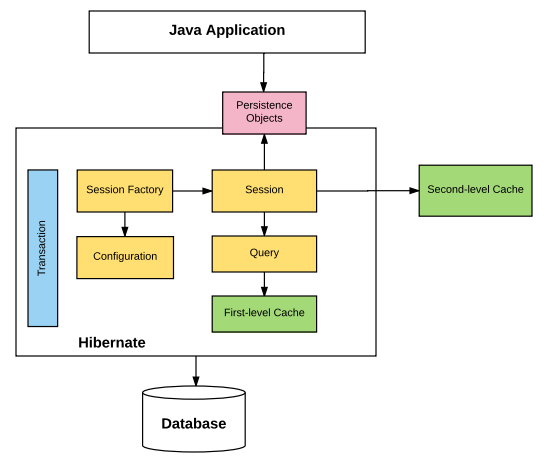

Hibernate
=========

# Overview
Hibernate is a Java framework for data persistence (database connectivity). One of its main functions is an an ORM (object-relational mapper). An ORM manages the relationship between a Java object and a relational database table. Hibernate also supports querying within a Java application using SQL or HQL (Hibernate Query Language).

By utilising Hibernate, there is no need to build up queries or interface with the JDBC directly. One major advantage of this is that the code does not need to depend on any specific RDBMS and there is no need to switch between SQL dialects. All major RDBMS technologies are supported.

## Architecture


Persistence objects are POJOs which Hibernate can interpret and map to a database. The Java application itself requests a session in order to interact with Hibernate. This session comes from a session factory which serves the objects in-accordance with the configuration created by the engineer. The session is used to establish a physical connection to the database.

# Usage

## Configuration
A configuration holds the connection details and the object-relational mapping which is required to generate the immutable session factory which the program will use to generate its session. Ultimately, the program will eventually generate a `org.hibernate.cfg.Configuration` instance which has been fully populated in some way.

There are many ways to create/populate all or part of this configuration objects such as:

* Building the object up completely in the program
* Passing a `hibernate.cfg.xml` file to the object
* Including a `hibernate.properties` file in the root of the project
* Setting the properties in a Spring `application.yml` file

### Connection Details

A `hibernate.properties` configuration may look like this:

```
hibernate.connection.driver_class = org.postgresql.Driver
hibernate.connection.url = jdbc:postgresql://localhost/mydatabase
hibernate.connection.username = myuser
hibernate.connection.password = secret
hibernate.dialect = org.hibernate.dialect.PostgreSQLDialect
```

Whereas an equivalent Spring `application.yaml` configuration may look like this:

```yaml
spring:
  datasource:
    url: jdbc:postgresql://localhost
    driver-class-name: org.postgresql.Driver
    username: myuser
    password: secret
  jpa:
    properties:
      hibernate:
        dialect: org.hibernate.dialect.MySQL5Dialect
```

A helpful list of Hibernate properties with example usages for different RDBMS systems can be found [in the Hibernate GitHub repo](https://github.com/hibernate/hibernate-orm/blob/master/etc/hibernate.properties).


### Mapping
Mapping between an object and a database table can be done with either an XML file or, if using Spring, annotations on the object.

A simple XML mapping to map an `Employee` object to an `EMPLOYEE` table would be named `Employee.hbm.xml` and may look like this:

```xml
<hibernate-mapping>
   <class name = "Employee" table = "EMPLOYEE">
      <id name = "id" type = "int" column = "id">
         <generator class="native"/>
      </id>

      <property name = "firstName" column = "first_name" type = "string"/>
      <property name = "lastName" column = "last_name" type = "string"/>
      <property name = "salary" column = "salary" type = "int"/>

   </class>
</hibernate-mapping>
```

The `type` in the above XML is neither strictly a Java type or a RDBMS type. To allow abstraction away from particular implementations, a set of Hibernate types (which very closely resemble common types in both of these other domains) is available. These types can be logically converted to the appropriate Java or RDBMS type automatically by Hibernate.

The equivalent annotated object may look like this:

```java
@Entity
@Getter
@Setter
@NoArgsConstructor
public class Employee {
   private int id;
   private String firstName;
   private String lastName;   
   private int salary;  
}
```
For sake of readability, the constructors and accessor methods have been included using Lombok annotations. The `@Entity` annotation is what identifies this object as a Hibernate persistence object.

#### POJO Requirements
A POJO that is to be mapped to a table must follow a set of rules:
* The class must not be final
* The fields to be mapped must be private
* The fields to be mapped must have accessor methods
* The object must have an additional `id` field
* The class must have a no arguments constructor (Other constructors can be included too)

## Transactions

### Barebones
A barebones way to interact with the database via Hibernate sessions may be as follows:

```java
Session session = factory.openSession();
Transaction tx = null;

try {
   tx = session.beginTransaction();
   // do some work
   tx.commit();
}

catch (Exception e) {
   if (tx!=null) tx.rollback();
   e.printStackTrace();
} finally {
   session.close();
}
```

Sessions should live for as little time as possible as they are usually not thread-safe. Therefore, the above code obtains a new session from the session factory, builds up a transaction, then commits (executes) the transaction. We can also rollback the transaction if some error occurred during the commit.

### Spring


# Resources
* https://docs.jboss.org/hibernate/orm/3.3/reference/en/html/
* https://www.tutorialspoint.com/hibernate/hibernate_overview.htm
