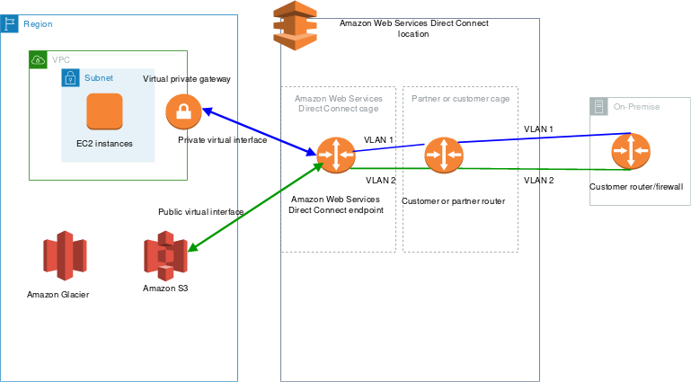
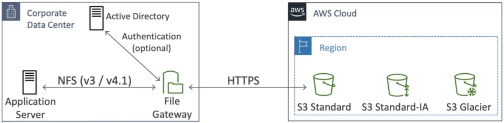
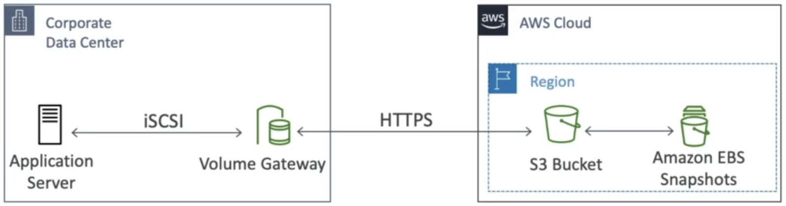
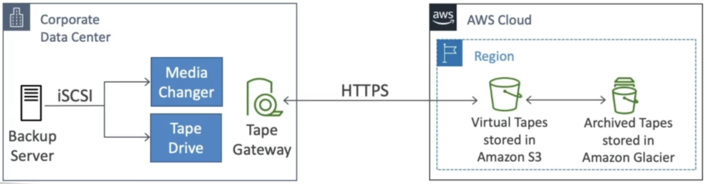
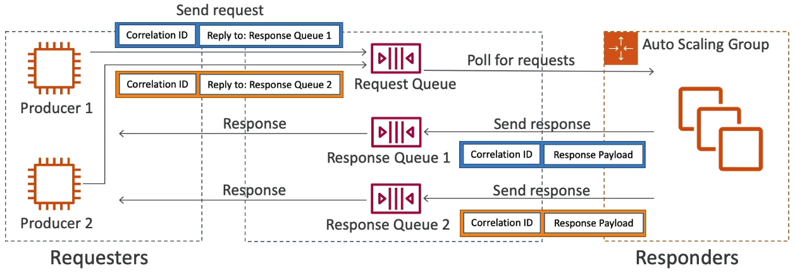
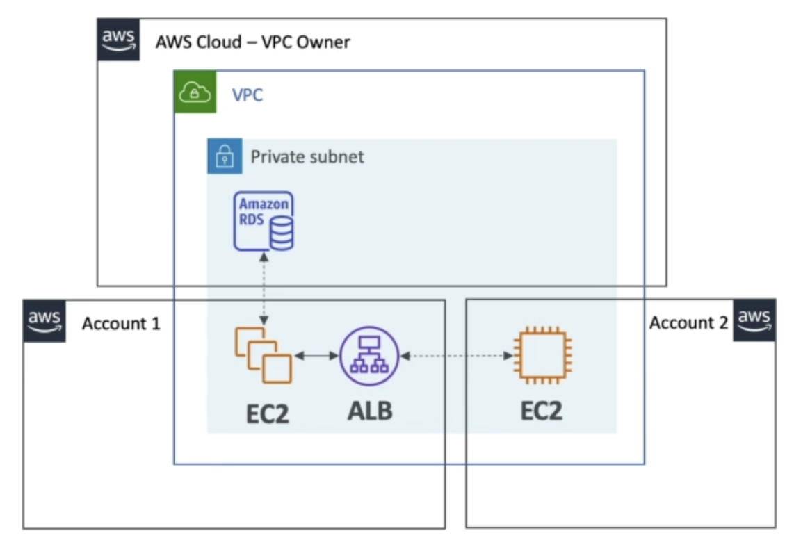

AWS Solutions Architect (Associate) Certification Notes
=======================================================

# What is AWS?
* AWS, Amazon Web Services, is a cloud provider.
* It provides servers and services for on-demand computing.
* In contrast to traditional on-premises IT, where computation power must be known ahead of time and is more or less fixed, cloud providers support scaling up/down on-demand.
* Common high-level use-cases include:
  * Data storage and backups
  * Web hosting
  * Application backends
  * Gaming servers
  * Big data analytics

# Location
## Regions
* AWS is split up into several physical locations across the world.
* For the most part, a customer will pick one specific region and their entire AWS system will live within this region.
  * The exception to this is the small set of global services.
* Regions differ in the services they offer and how much they charge for each service.
* Analogy: McDonalds (AWS) is a brand, but to operate in different countries, the operation is often structured as a new subsidury company (AWS Region) that is specific to the country that it operates in (for example, in the UK, "McDonald’s Restaurants Limited"). Customers only ever deal with this local company. The global brand will have influence on what each subsidury offers, but the offerings across countries will often not be identical.
* When choosing a region, several factors must be considered:
  * Regulatory compliance - Some countries may have restrictions on where data can be transferred to or held (e.g. GDPR).
  * Proximity - AWS servers physically near to customers will generally have a lower latency and thus provide a better experience.
  * Pricing
  * Available services

## Availability Zones (AZs)
* Each region comprises 2 or more AZs (typically 3).
* An AZ is some cluster of physical data centres that are physically independent from others.
* If one AZ goes down because of some issue (e.g. fire), in theory the other AZs will remain available.
* AZs are connected via a high-bandwidth, low-latency network connection.
* AZs are often used for data replication. Copies of data will be sent across the high speed network connection to be in-sync with the original, and if the original AZ goes down the data is still available in another AZ.
* The likelihood of all AZs in a region (and thus the entire region) going down is very low.

## Points of Presence (Edge Locations)
* In many cities around the world, AWS operates Points of Presence. These are local entry points into the AWS network and utilised by CloudFront and Lambda@Edge to reduce the latency that would otherwise be introduced if the user were to use more of the public internet to reach AZ data centres directly.

# Organisations
* A single company does not necessarily have a single AWS account.
* Multiple AWS accounts can be grouped together to form an *organisation*.
* In an organisation, one account is the *main account*, and there will be 1 or many *member accounts*.
* There are various architectural reasons a company may choose to hold multiple accounts, such as:
  * Creating different, isolated, environments for testing and production
  * Distinguishing the AWS resources used by individual departments
  * Regulatory restrictions
* If using an organisation, the fees for AWS services across each of the member accounts can be aggregated and, as such, paid for using a single payment method.
  * Aggregation is also applied for volume pricing, therefore the total cost across all accounts is likely to reduce when grouped within an organisation as the per-unit cost of services is reduced.
    * e.g. If some service charges £2 for 0-10 units and £1 for 11-20 units, 2 accounts individually that used 10 units would be more expensive than an organisation containing these accounts as collectively they would enter the 11-20 unit category for half of their collective requests.
* Accounts can be sub-divided further by grouping within *Organisational Units (OUs)*
  * You can have as many OUs as you wish and OUs can contain other OUs.
  * The arrangement of OUs is completely up to whatever architecture is desired by the company and makes sense for their admin purposes.
  * e.g. a company may have a main OU encomparing everything, then several OUs within it for departments, and within each department OU it may have further OUs for individual projects, and the project OUs will contain multiple accounts representing each environment.
* It is possible to restrict access to certain AWS services at the OU level using *Service Control Policies (SCPs)*
  * An SCP lists which IAM actions a user within an OU can or cannot use.
    * Not even the admin users within an account may access an action if the action is blacklisted in the SCP.
  * SCPs applied to the parent OU will cascade down to the child OUs.
  * The main account in the root OU is unaffected by any SCP, it can do anything it wants at all times.
  * SCPs can be especially helpful in applying a blanket ban within an account to services that are not compliant with some regulation that needs to be followed.
  * Deny policies take precedence over Allow policies, therefore, if an OU has inherited similar policies from its parents, one being a Deny and one being an Allow, the Deny will apply.
* To migrate accounts from one OU to another, the account must first be removed from the OU to which it belongs, and then it must be invited to the new OU.
  * If migrating the master account within an OU, all member accounts must be migrated away from the OU first.

# User and Permission Management
## IAM (Identity and Access Management)
* Global service - Settings span all regions
* Manages who/what is allowed to perform which actions in an AWS account.

### IAM Users
* An AWS account is viewed/modified by users. IAM specifies these users and what permissions they hold.
* An AWS account has a root user created when the account is set up. This user has unrestricted access to everything in the account and should generally only be used for creation of other, less privilidged, users.
* Users can be grouped into some logical collection which share the same permissions.
  * A user can belong to multiple groups.
  * e.g. a "Developer" group, or a "Managers" group.
  * Groups cannot contain other groups, they only contain users.
  * A user does not *have* to belong to a group, they can just be "floating". However this is not best-practice.

### IAM Roles
* A running application is not a physical person, however it may need to interact with AWS just like a user would. Instead of creating an IAM User for it (and thus breaking the concept that IAM Users are representations of physical people), we create IAM Roles and have the application assume it.
* An IAM Role has a collection of permissions attached to it just like a user or group would.
* Assuming a role is a temporary action.
* Unlike a user, a role does not have a set of credentials to "log in" to.
  * Instead, once something has assumed a role, IAM provides it with a set of temporary credentials that last for the finite lifetime of the session.
* Any entity which requires temporary access to AWS resources can assume roles including:
  * Applications
  * IAM users
    * We may wish to grant users from other AWS accounts access to our services by letting them assume one of our roles
  * AWS services like EC2 or Lambda instances

### IAM Policies
* A user (or a group) can be granted permissions by attaching an IAM Policy.
* An IAM Policy is a JSON document with the following structure:
  * ```json
    {
        "Version": "2012-10-17",
        "Id": "Allow-Stuff-And-Things",
        "Statement": [
            {
                "Sid": "1",
                "Effect": "Allow",
                "Action": [
                    "ec2:AttachVolume",
                    "ec2:CreateTags",
                    "iam:List*"
                ],
                "Resource": ["*"]
            }
        ]
    }
    ```
  * The above defines that some user/group shall be permitted to attach volumes in EC2, create tags in EC2, and perform any list action in IAM.
* There exists an AWS security principle known as the *Least Privilidge Principle* which recommends that a user should be granted the lowest privilidges possible to accomplish their job. This limits risk from accidents or malicious activity.
* There are 3 types of policy:
  * **AWS Managed Policies**: AWS provides a number of pre-defined generic policies that they update themselves for common use-cases (such as read access to a specific service).
  * **User-Managed Policies**: As above, but instead the customer creates their own re-usable policies.
  * **Inline Policies**: A policy is embedded in a specific IAM user. This policy is not re-usable and applies only to the user that it is defined within. It is a one-to-one relationship between user and policy.
* Keys/Terms:
  * `Version` - Policy language version
  * `Id` - Optional name to reference the policy
  * `Statement` - A single rule within the policy
  * `Effect` - `Allow` or `Deny`
  * `Action` - The privilidge to be allowed or denied
  * `Principal` - The person/application making the request
  * `Resource` - The specific resource this policy applies to (e.g. a specific S3 bucket)
  * `Condition` - Additional custom condition to evaluate to decide whether the policy should be applied.
    * `NotIpAddress` - Apply if the client's IP address is not one of the ones within the condition values
    * `RequestedRegion` - Apply if the region being requested matches one of the ones within the condition values
    * Various other including checking the values of tags on AWS resources and checking whether the user is currently authenticated via MFA
* There exists a tool called the **IAM Policy Simulator** which tests whether or not, for a given user, role, or policy, a specific action is permitted.

### Permission Boundaries
* A permission boundary is an IAM policy applied to a user or a role (not a group) that defines the maximum set of permissions this user/group can ever be granted.
* When obtaining permissions from other policies (e.g. typical IAM policies, resource-based policies, etc) if the permissions within those policies extend beyond what is defined in the user's/role's permission boundary, those permissions will not be granted.
* The permission boundary acts like a failsafe - you can be safe in the knowledge that a given user/role can never obtain permissions to do anything outside of what has been defined in that one particular file.
* Example use case: You wish to allow developers in your company the freedom to decide which permissions their users/roles need. However, you apply a permissions boundary to ensure they don't get over excited and grant themselves administrator privilidges to the AWS account.

### Policy Evaluation
* A user may have many policies applied to them (either directly or via their group(s)). This means that they have the potential to conflict. For example, if a policy attached to the user grants permission to read from S3 but a policy from their group explicitly denies reading from S3.
* IAM flows through a set of steps to determine whether or not any given user has permissions given the set of policies attached to them:
  * 

### User Account Security
* As with many online accounts, an AWS user/root accounts are targets for bad-actors and therefore steps can be taken to mitigate compromisation:
  * Password Policies
    * We can specify that all accounts within an AWS account should meet certain critera such as:
      * Minimum length
      * Containing specific character-types
      * Password expiry times
      * Not re-using past passwords
  * Multi-Factor Authentication (MFA)
    * Using another device in addition to a password to gain access to an account, for example:
      * MFA App (e.g. Authy) - Software that displays an MFA code
      * MFA Fob (e.g. banking fobs) - Hardware device that displays an MFA code
      * Universal 2nd Factor Security Key (e.g. Yubikey) - Plugs into computer
* Interfacing with AWS via command line or from code requires **Access Keys**. This means they can perform actions like a user but without providing it with the user's login credentials. The root user should not be used to generate access keys.

### Reviewing Permissions
* AWS advocates a principle of least privilidge where any given user should have access to only the permissions that they need to accomplish their job and no more. This limits the blast radius should something go wrong.
* In order to help with this, there are 2 tools:
  * IAM Credentials Report
    * Lists all users in an AWS account and their associated credentials status
  * IAM Access Advisor
    * For any given user, lists all of the permissions that have granted and also when they last used that permission.
    * In theory, if a user hasn't used a permission in a long time then they do not need it for their job and it may be reasonable to remove the permission.

## Cognito
* Cognito is a service to streamline the management of external users talking to your AWS system.

### Cognito User Pools (CUP)
* Can be thought of as a database of users.
  * Each user will have a username/email and password
  * We may also have 2FA set up for the user
* CUP is exclusively used for authentication (i.e. to prove who you are, it doesn't necessarily provide authorisation).
* The user will log in to CUP by sending their login details. In return, CUP will return a JWT token for the user to use in subsequent requests.
* Has integration with other identity providers (Google, Facebook, SAML, etc) so that their credentials can be used to log in to Cognito and Cognito will return a JWT token as it would if it was a "vanilla-Cognito" login.
* Primarily used to authenticate communication with API Gateway.

### Federated Identity Pools
* Inspects the JWT token provided by CUP and returns temporary credentials that can be used by a user to directly access some AWS resource.
* The temporary credentials that are returned have an associated IAM policy which determines exactly what the user will be allowed to do within AWS.

### Cognito Sync
* This is a service for synchronisation of application data for individual users.
* It includes both the service in AWS that manages the storage of the data, and the libraries which are integrated into application code to utilise the service.
* It is primarily used for application data such as user preferences.
* The library is used to record the specified user data and upload it to the Sync service in AWS.
* If there are other devices that need the same data, the library code running on the applications on those devices will constantly check for updates to this data and download it when available.
* If the user's device is currently offline, the library code will hold onto the request and update the AWS service when it next has a connection.
* It is possible to store up to 20 datasets of up to 1MB each.
* Requires Federated Identity Pools.
* Is now deprecated in favour of the similar *AppSync* service.

# Networking
## IP Ranges
* IP ranges can be defined using CIDR notation.
  * CIDR notation takes the form `192.168.0.0/16` where `192.168.0.0` is the base IP address and `/16` defines how many bits (from left to right) in the IP range are fixed/unchanging within the range it represents.
  * The above CIDR range would represent the IP range `192.168.0.0` to `192.168.255.255`.
* IANA reserves certain IP ranges for use only by private networks.
  * `192.168.0.0/16`
    * Small (home) networks
  * `10.0.0.0/8`
    * Large corporate networks
  * `172.16.0.0/12`
    * Represents the range `172.16.12.0` to `172.31.255.255`
* The maximum size of a CIDR in AWS is `/16` (i.e. the number can be 16 or larger as a higher number means fewer available IP addresses)
* IPv6 addresses can also (optionally) be used within AWS for services. However, IPv4 cannot be disabled.

## VPC (Virtual Private Cloud)
* A VPC is a virtual private network.
  * It simulates the networking behvaiour of a traditional data centre and facilitates communication of services inside the network to each other and with the internet.
* AWS accounts come with a default VPC. More can be created as needed.
* The VPC itself will have a CIDR range. However the VPC can be sub-divded into seperate subnets, each with a distinct range within the overall VPCs range for further isolation of resources.
  * Each of these subnets can reside in different AZs to the other subnets.
  * Any private CIDR range can be selected here.
    * It is generally best practice to choose a CIDR range that is distinct from any other networks that will be in use (e.g. a corporate network) so that, if we chose to link them in the future, there would be no IP conflicts.
  * For any subnet, 5 of the IP addresses are reserved by AWS and are not available to be assigned to instances within it.
* A VPC, by itself, cannot connect to the internet. By default, all traffic is contained within the VPC itself.
  * In order to provide a "way out" for the traffic that needs to go to/from the internet, we must assign the VPC an **Internet Gateway (IGW)**.
  * Traffic within the VPC that is destined for the internet, must be routed to the IGW. From here, the IGW will handle getting the traffic to the internet on behalf of the VPC.
    * To route traffic, based on the IP address it is destined for, we need to edit the **Route Table** assigned to the VPC to specify that IP addresses in the non-public range should be sent ot the IGW.

### VPC Peering
* VPC Peering connects two VPCs together so that they can communicate as if they were the same network.
  * The whole network in each VPC is accessible to the other network. Not specific services/components.
* To prevent address conflicts, the two VPCs that are peered must have non-overlapping CIDR ranges.
* VPC Peering strictly only allow connecting together a pair of VPCs - a single VPC peering connection can only suppport the communication between the two defined VPCs to communicate across it.
  * Multiple VPC peering connections can be set up to allow a single VPC to communicate with other VPCs.
* It is **not** transitive - A request from one VPC cannot hop over multiple VPC peering connections to reach a VPC that it is not directly peered with.
  * If a VPC needs to communicate with another VPC, it must have its own explicitly defined VPC peering connection set up.
* Every subnet that needs to communicate across VPCs, on both sides, must have its routing table updated to define that they traffic flow must go via the peering connection.
* VPC peering connections can join VPCs that are:
  * In the same account
  * In different accounts
  * In the same region
  * In different regions

### PrivateLink
* A method for exposing a service to many consumers without the need to peer networks or expose the service to the public internet.
* Can be consumed from the customer's own AWS account or from other accounts.
* The service being exposed must be connected to either a network load balancer or a gateway load balancer.
* The consumer application must be connected to an ENI.
* The AWS PrivateLink connection is made between the load balancer and the ENI to facilitate the communication.
* For fault tolerance, both the load balancer and ENI should be in multiple AZs.
* Once the link is created, AWS provides a URL endpoint that is then used by the consumer as the target for its requests.
  * Requests to this URL will be fulfilled by the PrivateLink.

### Routing Traffic to Private Subnets
* Although a VPC can be divided into several subnets, it is possible to route traffic between them. A common use case for this is to implement a *bastion host*.
  * This is an EC2 instance in a public subnet (one which has internet access) which has SSH access to instances in a private subnet (one without internet access) so that the private instances can be controlled remotely.
  * For security, a bastion host and the EC2 instances it connects to must have strict security group rules in place (i.e. only allow port 22 access). Otherwise the private EC2 instances might as well be in the public subnet as the private subnet would be offering little security.
* Bastion hosts are primarily used for human-interactions with private EC2 instances. But in many cases we may require traffic to flow to/from private instances as part of application logic.
  * The original way to achieve this was using **NAT Instances** (Network Address Translation).
    * This is an EC2 instance that can be deployed to a public subnet and will perform the communication to the external server on behalf of the private instance.
    * The NAT instance will see that the private instance is trying to communicate with some external server, capture the packets, re-write the source/destination packets, and forward the traffic on.
      * Source/destination re-writing is necessary as it becomes the new source of requests from the external server's perspective so it needs to write itself as the source so that the server can send the response back to it.
    * Any NAT OS/AMI can be deployed on an EC2 instance to perform the NAT functions. AWS used to provide an official AMI for NAT functionality but pulled support in 2020 in favour of alternative solutions.
  * The new/correct way to achieve this is to use a *NAT Gateway*.
    * This is a fully-managed version of a NAT instance.
    * Offers automatic scaling of bandwidth up to 45 Gbps.
    * Unlike with NAT Instances, as they are simple EC2 instances, NAT Gateways do not require security groups to be set-up. AWS handles the security of communication itself.
    * Cannot be used to perform NAT on instances within the same subnet (although, you probably wouldn't need/want to anyway). The traffic must come from another subnet.
    * Is deployed to an AZ. So if there exists EC2 instances in different AZs, with the same use-case, they will require their own NAT Gateway, in their own AZ, in order to work - they cannot use the NAT Gateway from another AZ.
* For IPv6-enabled instances in private subnets, it is possible to bypass public subnets and NAT gatways/instances for connecting to the internet securely by create an **Egress-Only Internet Gateway**.
  * This networking services is a hybrid Internet Gateway and NAT Gateway for IPv6 instances only.
  * It sits at the VPC-level and allows an IPv6 instance to connect to it directly to make IPv6 requests out to the public internet.
  * It is not possible for the public internet to initiate requests to the instances.
  * The reason we can connect directly to the Egress-Only Internet Gateway for IPv6 but cannot connect directly to an Internet Gateway for IPv4 is that the IPv4 address that an instance holds is a private address and the NAT Gateway is needed to re-write this for the public internet. However, IPv6 addresses, because there are so many of them, have no concept of private addresses. Therefore, the IPv6 address used by the private IPv6 instance is perfectly fine and addressable even on the public internet as it cannot clash.

### VPC Endpoints
* AWS services (such as DynamoDB, S3, or SNS) all reside within AWS's network, but are accessible via the internet.
* One way to access these services from a VPC is to communicate via the VPCs internet gateway and over the public internet.
  * If the subnet our application lives in is private, we will additionally also need to communicate via a NAT Gateway to get this traffic to the internet gateway.
  * This is sub-optimal:
    * Gateway access is quite expensive
    * The data is less secure as it goes outside of AWS's network
    * The latency is poor as the packets have many hops along the way, including going out-of only to come back-into AWS's network
* There exist two variants of VPC endpoints, but they acheive the same broad goal:
  * Interface Endpoints
    * These create an ENI inside the subnet that is linked to the service that it has been set up for. The ENI lives inside the subnet and performs AWS-magic to transmit the traffic to/from the service.
    * Security is managed by security groups.
    * Supports almost all AWS services.
  * Gateway Endpoints
    * Operate similarly to other gateways in VPC networking.
    * The gate way is responsble for handling the communication to a different location if the VPC is able to route traffic to it.
    * Requires changes to the subnet's route tables to ensure that traffic intended for the gateway is routed to the gateway.
    * Only supports S3 and DynamoDB.
    * AWS manages the entry in the route tables itself (The entry cannot be modified by the customer beynd adding/deleting it). They set it up in a way such that any traffic intended for the associated service will be routed to the gateway.

### Connecting an External Network to a VPC
#### Over the Internet
* Achieved by creating a *AWS Site-to-Site VPN*.
* Involves creating a *Virtual Private Gateway* on the AWS VPC that you wish to connect to, and a *Customer Gateway* on the external network.
  * Virtual Private Gateway is an AWS networking service just like Internet Gateway or NAT Gateway, but this gateway specialises in handling traffic to/from external networks.
  * Customer Gateway is an application or hardware device on the customer's external network that handles the communication to/from the Virtual Private Gateway.
* Communication will be over the public internet. But, as it is a VPN connection, will be encrypted.
* The external network must be publically addressable. If it isn't already, this can be achieved by having it communicate through a NAT.
* Requires *Route Propagation* to be set up in the VPC's route table.
* A single Virtual Private Gateway for a VPC can be used to communicate with multiple external networks at once.
  * These networks can also communicate with each other through the Virtual Private Gateway (i.e., it is transitive).
  * Utilised a hub-and-spoke pattern.
  * This feature is known as *AWS VPN CloudHub*.

#### Over a Dedicated Private Connection
* Achieved using Amazon Direct Connect (DX).
* Involves communicating with AWS without ever going over the public internet.
* Communication happens between an *AWS Direct Connect Location*. These are data centres (owned by third party partners), that have very fast direct physical links to AWS data centres.
  * Your business's network may already be hosted in this data centre and, if so, Direct Connect will be simpler to set up.
  * If your business's network is not aleady hosted in a partner's data centre, they will need to be contacted directly to discuss the best way to connect you to them.
* As with Site-to-Site VPN, requires the VPC being targetted to have a Virtual Private Gateway to set up to handle the traffic.
* The external network can access both public (AWS services like S3 and DynamoDB) and private AWS resources (e.g. Specific EC2 Instances) over the same Direct Connect connection.
* The partner can offer a *dedicated connection* where each customer is provided with their own physical ethernet port that no other customer is using.
  * Alternatively, the hardware/ports will be shared between customers of the partner - known as a *Hosted Connection*.
    * However, hosted connections are more flexible as their bandwidth can be scaled at will.
* Not all partners offer the same speeds or connection types.
* Offers a much better network
  * Higher speed (Up to 100Gbps)
  * Lower latency
  * Less risk of congestion
* It can take over 1 month to get a new Direct Connect connection set up as it required co-operation between both AWS and their partner.
* In typical setups, the data travelling through the network is not encrypted - however it is in a provate network so the risk of data breaches is low.
  * If extra security is needed, it is possible to set up a VPN for the connection between the customer's data centre and the partner, and then have the traffic from the partner to AWS also encrypted.
* For increased resiliecy, it is possible to set up Direct Connect connections to multiple partners
  * Therefore, if one partner goes down, the connectivity to AWS is maintained via the other partner location
* For maximum resiliency, in addition to connecting to multiple locations, it is possible to have multiple Direct Connection connections per location.



### Transit Gateway
* A networking service that allows many different networks (AWS VPCs and external) to talk to each other via a hub and spoke pattern - the Transit Gateway is the hub.
* Is transitive; everything can talk to everything else
  * Route tables are used to fine-tune this behavior.
* Supports:
  * VPCs
  * DirectConnect connections
  * Customer Gateway (AWS Site-to-Site VPNs)
* Can work cross-region by peering transit gateways in seperate regions
* Can work cross-account (Managed using Resource Access Manager)
* Is the only AWS service to support *IP Multicast*
* Multiple simultaneous AWS Site-to-Site VPN connections can be created for an external network to communicate to a Transit Gateway to increase throughput.
  * Without Transit Gateway, an external network can only have at most 1 connection to the VPC it is interested in.
  * Additionally, as the gateway acts as a hub to potentially many VPCs, there is no need to create a unique connection for each VPC if the external network was interested in multiple.

### DNS
* Instances in a VPC usually need to be able to resolve hostnames to IP addresses using a DNS server if they are to communicate to other systems (particularly public/external ones).
  * There are two options: use Route53, or host a custom DNS server within the VPC that the instances query.
  * To have access to Route53, we must enable the `enableDnsSupport` flag on the VPC.
    * When this is done, it is possible to access Route53 from both Route53s typical IP address (`169.254.169.253`) or via the reserved DNS IP address of the subnet (The 3rd IP address in the range).
* For instances within a VPC to be provided with a hostname, the `enableDnsHostnames` flag must be enabled.
* It is possible to create a *Private Hosted Zone* in Route53 which contains DNS records for specific VPCs.
  * This enables you to give hostnames to instances in private instances and therefore other instances within the VPC can find the private instances via the hostname (via Route53) rather than needing to know its IP address.

### NACLs (Network Access Control Lists)
* A NACL is very similar to a security group. It acts like a firewall. However, unlike security groups, which act instances/services, NACLs operate on a subnet.
* Each NACL contains 2 rule lists, one for inbound and one for outbound packets, specifying whether or not to allow the traffic depending on its protocol, IP source/destination, port, etc.
  * Works using a precedence mechanism. The lower the precedence number associates with an individual rule, the more important it is.
  * A request is evaluated by looking for the first rule match that matches up with the IP address from the rule list (starting at the rule with precendence number of `1`), and denying/allowing depending on what that specifies.
* Unlike security groups, NACLs are stateless.
  * i.e., the packets are evaluated both when they are incoming and outgoing, even if they are part of the same overall request.
    * With security groups, if the packets were allowed in (incoming request), the response packets are automatically allowed out too.
* A default NACL is included on all subnets in a VPC
  * This NACL allows all traffic into our out of the subnet it is associated with.
* When sending a request, the server needs to know the client port to send the response to. Usually, this port will be created on-the-fly for the purposes of receiving that specific response - this is known as an *ephemeral port*.
  * This therefore means that a server that some instance talks to may be required to talk to one of potentially thousands of possible ports and there is no way to know which one specifically ahead of time.
  * It is important to therefore, if ephemeral ports will be used by instances within a subnet, to ensure that the NACL rules allow traffic for the entire range of possible ports.

#### NACLs vs Security Groups
| NACLs                                                              | Security Groups                                                        |
|--------------------------------------------------------------------|------------------------------------------------------------------------|
| Applied to individual subnets                                      | Applied to individual instances                                        |
| Supports ALLOW and DENY rules                                      | Supports ALLOW rules - everything else implicitly denied               |
| Stateless: Return traffic needs explicit permission                | Stateful: Return traffic automatically allowed                         |
| Rules evaluated in priority order until a matching rule is reached | All rules are evaluated before deciding whether the request is allowed |

### VPC Reachability Analyser
* A tool provided by AWS to test whether or not traffic can flow between two endpoints within a VPC.
* Produces a report explaining where/why traffic was blocked along the route if the transfer was unsuccessful.
  * It may detail problems with NACLs, security groups, route tables, etc.
* It does not actually send packets through the VPC - it tests against an equivalent model of your VPC in its own environment.
* A single test of connectivity between two endpoints is charged as a $0.10 flat fee.

### VPC Flow Logs
* Traffic moving to/from/through VPCs can be logged to S3 or CloudWatch.
* Logs contain the following fields per record:
  * Version
  * Account ID
  * Interface ID
  * Source
  * Destination
  * Port
  * Protocol
  * Packets
  * Bytes
  * Start time
  * End time
  * Action (Accept/Reject)
  * Log status
* They are invaluable when troubleshooting why a service may be experiencing connectivity issues
  * We can trace the flow of traffic to determine where it was blocked or mis-routed
* Logs can be at different granularity levels:
  * VPC level
  * Subnet level
  * ENI level
* Included traffic to/from AWS-managed networking services too (e.g. Internet Gateway)
* Can send to AWS Athena for complex querying

### VPC Traffic Mirroring
* This tool facilitates the copying of network packets to a new destination in-flight.
* It is effectively a packet-capturing tool.
* The original traffic is unaffected and unaware that it is being spied on.
* The source, destination, and various other filtering attributes are defined to identify which packets should be captured.
* Any packet that is captured/mirrored is sent to a desination of choice.
  * e.g. we may send it to an EC2 instance which is running some traffic analysis software.

## Networking Costs
* Traffic within the same AZ is free
* Traffic across AZs in the same region costs money per GB
  * If the traffic stays within the AWS network (i.e. is using private IP addresses, not touching the public internet), the cost is half as much as if it goes outside of the AWS network (i.e. public IP addresses, on the public internet for some of the journey).
* Traffic to a different region charges cost money per GB
* Sending data into AWS is typically free
* Sending data out of AWS typically costs

# High-Performance Computing Networking
* In distributed HPC systems, where multiple nodes need to transfer lots of data between each other very quickly, the network between them need to not be a bottleneck.
* The most basic way of having an EC2-based HPC system perform with strong bandwidth is to initialise the instances in *Cluster* mode. This means that the EC2 instances will be located on the same physical server rack as each other.
* A more advanced method is to utilise *EC2 Enhanced Networking*, also known as *SR-IOV*.
  * This offers higher bandwidth (Up to 100 Gbps) and lower latency.
  * This can be enabled by attaching an *Elastic Network Adapter (ENA)*. This provides the full 100 Gbps bandwidth.
  * It can also be anabled by attaching an *Intel 89925 VF*. This provides up to 10 Gbps but is a legacy adapter.
  * This works for any EC2 AMI.
* For Linux AMIs, an *Elastic Fabric Adapter (EFA)* offers even more improved networking capabilities (particularly, lower latency).
  * Utilises advanced message passing protocols implemented by Linux kernels.

# STS (Security Token Service)
* Responsible for finding out whether or not a user has the rights to access some AWS resource and returning a token for temporary access if it does.
* Access to the target AWS resource is done by allowing the user to assume some IAM role that has access to that resource.
* The tokens it issues, are valid for up to 1 hour.
* The users that it evaluates can either be:
  * IAM users (from either the local account or some other account)
  * Users logged in via an external identity provider that utilises SAML
  * Users logged in via an approved AWS identity provider partner (Google, Facebook, etc)
    * Although this method is now deprecated by Cognito
* STS is also responsible for generating MFA tokens for access to AWS root accounts
* With federated user access (users managed outside AWS), the user authenticates themselves with the external identity provider, the identity provider sends the user some response, and this response is sent to STS by the user (or perhaps via a custom identity management application on the local network that manages everyone's login process to AWS). STS verifies with the trusted external identity provider whether this response was legitimate, if so STS grants the token.

# AWS Active Directory
* A managed service offering a cloud-based Microsoft Active Directory.
  * Microsoft Active Directory is a platform offered on Windows operating systems that manages and maps various network-connected resources.
    * Users
    * Devices
    * Permission groups
    * File shares
  * For user management, many organisations have a local AD server on their network that is used to authenticate users logging into one of the many client machines also on the network. It means that anybody's credentials will work on any of the organisation's machines.
* A trust-connection can be established with an existing on-premises AD server.
  * Any requests for authentication will be checked against the databases in both the on-premises and hosted versions of AD. If it exists in either, the request is approved.
* The service can be configured in such a way that it manages no data itself, but instead simply acts as a proxy for an on-premises AD server.
  * This is known as *AD Connector*
* A simplified version of Microsoft AD is also available on AWS, called *Simple AD*.
  * It offers a subset of features of the full AWS Active Directory offering.
  * In this setup, only a hosted version of AD exists, no on-premises counterpart.
  * Instead of being a hosted Microsoft AD, it is actually a hosted Samba AD, this follows many of the same protocols, but is not feature-complete.

# AWS SSO
* AWS offers an SSO solution whereby a single username/password can grant access to a variety of AWS and non-AWS applications/resources.
* AWS SSO integrates with various user management systems (e.g. AD) to fetch a list of distinct users. The service is then responsible with integrating with other applications/services (e.g. GitHub, Dropbox, Office365) and logging in the user so they can use these services without creating additional accounts.
  * Alternatively, AWS SSO can also act as the identity provider itself, without needed an external application/server to manage users.
* AWS SSO works by sending over a SAML 2.0 file on behalf of the user that is logging in, therefore, it is compatible with any cloud application that accepts SAML 2.0.
* As well as granting access to external applications, AWS SSO can be used to log in to one or multiple AWS accounts.
* In contract to using STS, if using AWS SSO, there is no need to develop login screens/servers or manage the passing of SAML files and tokens between various components; AWS SSO handles much of the work for you.

# EC2 (Elastic Compute Cloud)
* Rent a virtual server on AWS
* Encompasses the ability to:
  * Rent a server instance (**EC2**)
  * Rent a virtual storage volume (**EBS** - Elastic Block Store)
  * Distribute load (**ELB** - Elastic Load Balancer)
  * Manage scaling (**ASG** - Auto-Scaling Groups)
  * Manage firewall (**Security Groups**)

## Instances
* An EC2 instance is a single virtual machine.
* Instances following the naming convention of `[instance_type][generation].[size]`, for example, `t2.micro`.
  * Instances within the same type will typically be running on similar physical hardware and the size will dictate exactly how much CPU and RAM is available.
  * Different specifications cost different amounts.
  * Computing power is measured in *vCPUs*. Where a vCPU is equal to the number of cores multipled by ht enumber of threads per core (basically, the number fo threads in total). In some instances, the number of cores and threads per core can be configured, in others it is immutable.
* Instance types fit broadly into several categories:
  * General-Purpose
    * A balanced mix of CPU, RAM, and networking speed.
  * Compute-Optimised
    * For computationally-intensive tasks such as batch-jobs or machine-learning.
    * Run on high-performance processors.
  * Memory-Optimised
    * For instances running memory-intensive tasks such as large in-memory databases or caches.
    * Use lots of high-bandwidth RAM.
  * Storage-Optimised
    * For instances requiring high I/O throughput such as data warehousing.
* The base image loaded onto an instance is known as an Amazon Machine Image (AMI). These are similar to Docker base images.
  * AMIs are either made by AWS themselves, by the community, or by the user.
  * AMIs include a variety of Linux distributions, Windows Server images, corporate software setups, etc
* When an instance runs, it can be provided permissions to interact with other AWS services by having it assume a role.
* To have the instance perform a set of pre-defined steps upon launch, a bootstrap script can be provided ("User data").
  * This may be used to, for example, install packages via the image's package manager, and then boot up a web server.
* If an AMI has SSH bundled and enabled by default, it is possible to connect to it via SSH using the private key provided at creation. It is also possible to connect to some AMIs (such as "Amazon Linux 2") using "EC2 Instance Connect" which is a web-browser-based SSH client for some AWS AMI instances.
  * Despite being within the AWS management console, to use EC2 Instance Connect, the instance must have the SSH port (22) allowed as an inbound rule on its security group.
* Meta-data about an instance can be found on the instance itself by running `curl http://169.254.169.254/latest/metadata/`.
  * This includes information such as the current role the instance has assumed, it's IP addresses, and so on.
* It is possible to download certain AMIs, such as "Amazon Linux 2" as files that work with virtual machine software. So you can export your EC2 instance, as an image, to run on-premise.

## Security Groups
* A security group is similar to a firewall; it defines the network rules that allow traffic to flow into or out of EC2 instances.
* A security group can contain many instances
* An instance can belong to many security groups
* By default (without additional rules):
  * All inbound traffic is blocked
  * All outbound traffic is allowed
* Security groups can reference other security groups in its rules
  * We can therefore block/allow instances in one security group to talk to those in another without having to reference IP addresses.
* If a connection is disallowed by a security group rule, it will time out. It will not be actively denied.
* Technically, a security group is attached to an ENI (see below), not to an instance directly.

## Instance Purchasing Options
* Choosing an instance type and spinning it up is the most convinient and simple, but also the most expensive way to purchase instances.
* By purchasing them in a different manner, cost can vary:
  * Reserved Instances
    * These are instances that we purchase for a specified amount of time (1 or 3 years).
    * Because this commitement has been made, AWS offers a discount.
  * Convertable Reserved Instances
    * Reserved instances where the instance type can be changed at-will. However, by providing this ability, AWS charges more.
  * Scheduled Reserved Instances
    * Reserved instances which are available on a regular schedule (e.g. Every day from 5pm to 7pm).
  * Spot Instances
    * Pricing for instance types operates like a stock market where the market rate fluctuates.
    * The buyer specifies a maximum price they are willing to pay for their instance, if the price ever exceeds this, it will be terminated.
    * Useful for workloads that are not greatly impacted by temporary failure of processing nodes. For example, distributed workloads.
    * It is possible to assign a "Spot Block" to prevent the instance being terminated regardless of price for between 1 and 6 hours if you, for instance, have something critical running.
    * The request for a spot instance can be persistent (keep the request open until some submitted expiry) or one-time (if the instance is ever terminated because it exceeded the max price threshold, don't ever bring it up again).
    * If multiple spot-instances are required for a task, a **Spot Fleet** can be set-up.
      * A Spot Fleet is a specification for the set of spot instances (and optionally also on-demand instances) that are desired as well as the budget.
      * AWS will determine the best mix of instances to meet the targets set in the spot fleet request and launch the appropriate instances.
      * A spot fleet can either be one-off (*request*) or persistent (*maintain*).
        * With a *request* type, instances are launched to meet the criteria, but no effort is made to AWS to keep this satisfied afterwards. If instances are terminated, nothing will automatically bring replacements back up to meet the same service level.
        * With a *maintain* type, instances are launched to meet the criteria, and AWS constantly monitors the state of the fleet to ensure it always meets the criteria specified. If instances are terminated, AWS will provision more to get the capacity back up to the desired level.
  * Dedicated Host
    * Renting a *specific* physical server for instances for 3 years at a time.
    * Expensive.
    * Useful for regulatory compliance reasons.
    * Useful to comply with licensing restrictions for certain BYOL (Bring Your Own Licence) software.
    * Can control what is running on the server.
    * Pay per server.
  * Dedicated Instances
    * Renting *some* physical server for your instances. However, not a specific one.
    * AWS may decide to move your instance over to a different (bigger/smaller) server (which will still only have your instances on it). They promise that only your instances will be on the hardware, but not that it will stay on the *same* hardware.
    * Pay per instance.

## Networking
* An EC2 instance is automatically allocated a public IPv4 and IPv6 address.
  * Each time an instance is started/stopped, there is a risk the IP address will change.
  * An IP address is owned for the entirety of the time an instance is running.
* Instead of using the default public IP an EC2 instance runs with, it is possible to assign it one of the IPs that you own as an account via the Elastic IP service.
  * By default, with Elastic IP, you have a pool of up to 5 public IP addresses that you can freely attach to any instance you wish.
  * These IP addresses stay the same regardless of whether they are in use or not. Containers starting and stopping do not affect the fact that you own these 5 IP addresses, they will remain.
  * The number of IPs can be raised from the default of 5 by requesting more from AWS support.
  * Using Elastic IP is often bad practice however as there are generally better architectural solutions.
    * For instance, using DNS (Route53) rather than distributing public IP addresses means the same string can map to different instances dynamically.
    * Or, using load balancers (ALBs) can be used to eliminate the need for public IPs on instances entirely.
  * Elastic IPs cost money if they are being wasted (i.e. not attached to an instance).
* The AWS component which grants an EC2 instance networking capability is an **Elastic Network Interface** (ENI).
  * An ENI attaches to EC2 instances to provide:
    * 1 public IPv4 address.
    * 1 or more private IPv4 addresses.
    * A MAC address.
    * Security groups.
  * An ENI is a virtual network card.
  * ENIs are not bound to an instance, they reside independently.
    * However, they are AZ-specific, they cannot move across AZs.
  * Security groups are actually attached to ENIs, not to instances directly.

## Instance Placement Groups
* The physical placement of EC2 instances can be configured to live within an instance placement group whcih defines where instances sit in relation to one another. The choice in group type forms a spectrum of latency and availability:
  * Clustered
    * All instances are on the same physical rack.
    * Lowest latency.
    * Lowest availability. If the rack fails, the entire application goes down. Application will be constrained to 1 AZ.
  * Partitioned
    * Spread the instances across multiple partitions (racks).
    * Can have hundreds of instances per rack.
    * Those instances in the same partition as another will have very low latency but risk going down together upon rack failure.
    * Instances placed in other partitions are protected if anther partition fails.
    * May be across AZs.
  * Spread
    * Every instance is placed on a physically different rack.
    * High latency as networking must always be done between different pieces of physical hardware.
    * Highest availability. If one rack fails, it affects at most 1 instance.
    * Limited to 7 instances per group per AZ.

## Hibernation
* Instead of stopping an instance (thus shutting down the OS and requiring it to load back up when restarting the instance), certain instance types and AMIs support hibernation.
* EC2 Hibernation saves the state of RAM at the point of hibernation to the root storage (The volume that the OS for an instance is running from).
* When restarting from hibernation, the RAM is restored from the volume that it was saved to.
* As far as the running instances knows, nothing happened.
* An instance is permitted to stay hibernated for up to 60 days.
* There are several requirements for EC2 Hibernate:
  * Is a supported instance type
  * Is a supported AMI
  * Instance is using EBS for storage
  * The storage volume is encrypted
  * The storage volume is large enough to fit the RAM dump into
  * The instance is On-Demand or Reserved (Not Spot)

## Storage

### Elastic Block Store (EBS)
* Supports the creation of network drives that can be attached to an EC2 instance.
* Existence of EBS volume persists regardless of the state of EC2 instances.
  * Therefore, the EBS volume can exist even if its associated EC2 instance is terminated or even if it never has an associated EC2 instance at all.
* Bounded to a single AZ.
  * However it can be migrated across as a snapshot (backup).
* An EC2 instance can have many EBS volumes attached to it at the same time.
* Depending on the EBS type, it can either be restricted to being attached to at most one instance at a time or, if it is Nitro-enabled, can attach to multiple at a time with multi-attach.
* Billing is based on capacity where capacity is a mixture of:
  * Volume storage size
  * Input/Output Operations per Second (IOPS)
  * Throughput
* EBS volumes can be useful for failovers as they can be detached from one instance and attached to another quickly.
* An EBS volume can be set to be deleted upon termination of the instance that it attached to.
  * By default, the root volume is set to delete upon termination.
  * By default, no other volumes are set to delete upon termination.
  * This setting is easily toggled for any specific volume.
* The characteristics of the volume are determines by the EBS instance type
  * `gp2` / `gp3`: General purpose SSDs.
    * Between 1GB and 16TB volume size.
    * Maximum IOPS performance only guaranteed for short bursts.
    * `gp2`'s IOPS is linked to the volume size.
    * `gp3`'s IOPS can be fine-tuned independently of the volume size.
  * `io1` / `io2`: High performance SSDs.
    * Between 4GB and 16TB volume size.
    * Maximum IOPS performance can be sustained for the lifetime of the volume.
    * Useful for databases.
    * Requires a Nitro-enabled EC2 instance to exceed 32,000 IOPS.
    * IOPS can be fine-tuned independently of the volume size.
    * Is the only type that supports multi-attach.
      * Assuming it is formatted as a cluster-aware filesystem.
  * `st1`: High-throughput HDD.
    * Intended for data-warehousing or logging.
  * `sc1`: Low-throughput (cold) HDD.
    * Lowest cold.
    * Intended as an archive drive.
* Only SSD instance types can be used as the root volume of an EC2 instance.
* EBS volumes can be encrypted. When encrypted:
  * Data is encrypted at rest.
  * Data is encrypted in-flight.
  * Associated snapshots are encrypted.
  * Minimal latency is introduced.
  * All encrypting/decrypting is handled by AWS, there is no noticable difference from the OS's perspective.
  * AES-256 is used and utilised keys from KMS (Key Management Service).
* Although it is not natively managed by AWS, it is possible to set up a RAID configuration using EBS volumes if the OS of the instance supports it.
  * In partiticular, AWS suggests using RAID 0 or RAID 1 only.
    * RAID 0: Increased throughput. Spread files across two volumes to leverage the IOPS of both drives and increase the total volume size available.
    * RAID 1: Increased fault-tolerance. Mirror files across both drives. No increase in performance, but no loss of data if one volume fails.
* When an EC2 instance is created, this implicitly creates a "root" EBS volume which houses the OS/system files to boot with.
  * When the EC2 instance is terminated, the toot EBS volume is also terminated.

### Local EC2 Instance Store
* Another way to attach storage to an EC2 instance is with a Local EC2 Instance Store.
* These are drives physically connected to the instance rather than being a virtual network drive.
* The primary advantage of this sotrage type is that it is much faster (Higher IOPS).
  * The specific specs are dependant on which specific instance size is selected.
* The main disadvantage is that data on these drives is not persistent after the EC2 instance is stopped.
  * It is therefore best suited for hosting caches/buffers rather than being a long-term storage solution.

### Elastic File System (EFS)
* A hosted file system spanning all AZs that can be shared by EC2 instances.
* Very expensive - but pay per-use.
* Secured by security groups.
* Used by services which require a common data store such as web serving.
* Only supported by POSIX (Linux) based AMIs.
* Has very high performance: thousands of concurrent clients, over 10GB/s throughput.
* Huge potential size (Petabyte-magnitude).
* Performance modes:
  * General purpose: Low latency, lower throughput.
  * Max I/O: Higher latency, higher throughput.
* Throughput modes:
  * Burst: Throughput propostional to storage size. Higher throughput available as bursts.
  * Provisioned: Set throughput independently from storage size.
* **Storage tiers** is the concept that files can be moved to different tiers that define whether or not they will be accessed frequently.
  * If set to be infrequently accessed, the storage cost is decreased, but the retrieval cost is increased.
  * A policy can be set to move files to different tiers automatically after a specified period of time.

### FSx
* Similar to EFS in the sense that it is a virtual file system which compute instances connect to in order to store data.
* Primary difference is that we are choosing what server technology that is powering the file system is
  * The file systems on offer are more specialised than typical servers
  * As with EFS, are aimed at high performance
* Can be deployed in one of two modes:
  * Scratch
    * Temporary
    * High burst throughput rates
    * No replication of data - so greater chance of data loss caused by server failure
  * Persistent
    * Long-term
    * Data replicated within same AZ

#### FSx for Windows
* The file system server is an instance of Windows Server.
* Exposes the file system using the SMB protocol.
* The drive is formatted as NTFS.
* Up to 2 GB/s throughput, millions of IOPS, and 100s of PB capacity.
* Backed up to S3 daily.
* Supports Active Directory (AD).
  * Can either be an AWS-managed AD service, or an non-AWS AD server.
* Accessible from on-premise infrastructure.

#### FSx for Lustre
* Lustre is a parallel distributed file system cluster used for incredibly high volume/throughput workloads.
* 100s of GB/s throughput, millions of IOPS, sub-ms latency, 100s of PB capacity.
* Can read from S3.
* Can write results straight to S3.
* Accessible from on-premise infrastructure.

### AWS Transfer Family
* A middleman service that exposes S3 and EFS via FTP/SFTP/FTPS.
* Supports IAM.
* Can be used with Route53 to provide a nice URL to reference the FTP server.

## DataSync
* A service to periodically synchronise data held in some volume/service into another.
* Intended for the transfer of large amounts of data into AWS.
* Can be used with on-premise or AWS-hosted storage systems.
* Requires a *DataSync Agent* application which runs near to the source (On a server if on-premise, on an EC2 instance if in AWS).
  * This agent is what reads from the volume and performs the communication with AWS's DataSync service.
* Synchronisation can run daily, weekly, or monthly.
* Storage instances will be out-of-sync between synchronisation jobs - it is not a continuous synchronisation service.

# Scaling and Availability
* Scalability can be:
  * Vertical - Increasing size of instance (giving it more power)
  * Horizontal - Increasing the number of instances
* Availability is the measure of how resilient a system is to failure
  * A primary way to manage this in AWS is to ensure that the system's core components are in at least 2 AZs (data centres) at any one time.

## Elastic Load Balancer (ELB)
* A load balancer provides many benefits to a system, it:
  * Spreads load across pool of instances
  * Provides a single entry point to users - no need to know about how many instances are running or even their existence
  * Monitors health of instances and diverts traffic away from them if unhealthy
  * Separates public and private traffic
* EBS encompasses the range of managed load balancers that AWS offers
* Managed service - upgrades/maintenance fully handled by AWS.
* Pricier than implementing own load balancing, but less time consuming.
* Can be configured to perform a health check on any instances it is configured to route to
  * It will periodically poll a port and route on the instance, if HTTP 200 is not returned, the instance will be marked as unhealthy
* As with EC2 instances, a load balancer can have a security group attached to it
  * A common scenario would be to have a load banacer on the load balancer to allow all inbound HTTP traffic, and then a security group on the EC2 instances to only allow HTTP traffic from the load balancer (Or, more specifically, the load balancer's security group).
* The capacity of a load balancer can be scaled, but it takes time.
* ELB access logs log all requests and CloudWatch can provide aggregated statistics.
* "Stickiness" can be configured for certain ELBs.
  * A cookie is generated so that subsequent requests from a user are handled by the same instance.
  * Cookie can be either be:
    * Duration-based
      * The cookie has a TTL after which it will no longer apply.
      * Generated by the load balancer
    * Application-based
      * Interpretation and management of the cookie is left to the instance.
      * The instance will choose whether or not to re-issue the cookie back in the request or to stop sending it back (thus ending the stickiness session).
      * Can be generated by the load balancer or the application.
* Cross-Zone load balancing can be enabled if there are ELBs in different AZs for the same application.
  * If this is disabled, a specific load balancer will only route to instances in its own AZ.
  * If this is enabled, it will distribute it's load across all instances across any enabled AZ.
* Supports SSL/TLS
  * Traffic to the ELB will be encrypted.
  * Once traffic reaches the ELB, SSL termination will occur and the request will then be sent in the network unencrypted.
  * **Server Name Indication (SNI)** is necessary so that one ELB can serve multiple different destination domains.
    * This is a protocol where the client sends the desired destination hostname alongside the SSL handshake.
    * The ELB can then look up the correct SSL/TLS certificate from it's pool of certificates that matches the hostname.
  * Certificated are sourced from **AWS Certificate Manager (ACM)** or they can be uploaded directly.
  * Connection Draining (also known as Deregistration Delay) is the maximum amount of time to wait for existing requests to complete when terminating an instance.
    * We may be terminating the instance because of scaling or because it has become unhealthy.
    * While the instance is in the draining state, it will only work on existing connections, no new connections are routed to it by the ELB.
* **Auto-Scaling Groups (ASG)** are used to scale an application out (more instances) or in (fewer instances) in response to need.
  * An ELB is aware of the number of instances in an ASG.
  * An ASG maintains 3 primary metrics:
    * Minimum size - fewest number of instances that we want running at any one time
    * Maximum size - highest number of instances that we want running at any one time
    * Actual size ("Desired capacity") - the number of instances running at this moment [VERIFY]
  * An ASG has a blueprint for instances that it should create known as the "Launch Configuration" (Or the newer "Launch Templates"). It is very similar to the information provided as part of the setup for an EC2 instance in any other way.
    * Launch configurations
      * Older and no longer recommended
      * Are re-created each time a new ASG is made
    * Launch template
      * Performs all the actions of a launch configuration
      * Supports inheritance from existing launch configurations
      * Supports versioning
      * Cab define a mix or on-demand and spot instances in the same template
  * A "Scaling Policy" defines the requirements for scaling in or out. The policy can be 1 of 3 types:
    * Dynamic
      * Target Tracking
        * Try to maintain this metric as the average for the group
        * e.g. The group should have an average of 40% CPU utilisation.
        * e.g. The group should have an average of 40 requests in per pod per second.
      * Simple / Step
        * Create some alert in CloudWatch, when the ASG sees that a particualr alert has fired, act accordingly
        * e.g. CloudWatch is set up to fire an alert if average CPU usage rises above 70%. When ASG sees this alert, increase instances by 2.
        * e.g. CloudWatch is set up to fire an alert if average CPU usage falls below 30%. When ASG sees this alert, decrease instances by 1.
    * Scheduled
      * Instance count should increase/decrease by/to a certain amount at a specific time.
      * e.g. Set number of instances to 10 at 2pm every day.
    * Predictive
      * Utilise AWS's machine-learning capabilities to forecast load into the future and adjust instances based on this.
  * If an ASG has an IAM role, the EC2 instances it creates will also be given this role.
  * ASG itself is free, fees are related to the instances it creates.
  * After scaling has occured, the group enters a cooldown period where no changes to the number of instances will happen for some amount of time (Defualt: 300 seconds). This allows the metrics to stabalise before adjustments are reconsidered.
  * When scaling down, by default, AWS decides on the particular instance to destroy by:
    * Selecting the AZ with the most instances
    * Choosing the instance with the oldest launch configuration/template
  * The typical lifecycle of instances within an ASG is as follows:
    * Pending
    * In Service
    * Terminating
    * Terminated
  * It is possible to attach lifecycle hooks to the "Pending" and "Terminating" states so that custom actions are performed at these stages.
    * For example, duuring the "Terminating" state, we may wish to extract logs before the instance is terminated.
    * While performing a hook, the instance enters the "Pending:Wait" or "Terminating:Wait" state.
    * Once a hook is performed, the instance enters the "Pending:Proceed" or "Terminating:Proceed" state and shortly afterwards reaches the "Terminated" state.

### Classic Load Balancer
* Somewhat-deprecated; use is discouraged.
* Supports HTTP, HTTPS, TCP.
* Does not support IPv6.
* Supports stickiness.
* Cross-Zone load balancing is enabled by default via web console and disabled by default via CLI/API.
  * No additional charges for routing across AZs.
* Does not support Server Name Indication (SNI).

### Application Load Balancer (ALB)
* OSI layer 7 (Application): HTTP, HTTPS, WebSocket
* Supports redirection (For instance, from HTTP to HTTPS)
* Supports routing tables to build rules to route to specific target groups based on various criteria
  * Path
  * Hostname/Subdomain
  * Query values
  * HTTP headers
* Target groups can be pools of:
  * EC2 instances
  * Lambda functions
  * ECS tasks
  * Private IP addresses
* The instance handling the request no longer directly sees the IP address of it's client, it sees the load balancer as its client instead. However, ALB adds a `X-Forwarded-For` header to the request containing the original client's IP address as well as `X-Forwarded-Port` and `X-Forwarded-Proto`.
* ~400ms latency
* Accessible via a domain name.
* Supports stickiness.
* Cross-Zone load balancing is always on.
  * No additional charges for routing across AZs.
* Supports Server Name Indication (SNI).

### Network Load Balancer (NLB)
* OSI layer 4 (Transport): TCP, TLS, UDP
* Much more performant than an ALB as it is working at a lower level
  * ~100ms latency
  * Millions of requests per second
* Accessible via a static IP (per AZ).
  * Can use an Elastic IP if the randomly-assigned one is not desirable.
* Traffic appears to have come directly from the original client, the request is not manipulated at all (No change of source destination).
* Cross-Zone load balancing is off by default but can be enabled.
  * Charges apply for routing across AZs.
* Supports Server Name Indication (SNI).

### Gateway Load Balancer
* OSI layer 3 (Network): IP
* Used if we wish all traffic to a specific destination to be sent via some other system for the purposes of processing the traffic first.
* Is typically used by firewalls, intrusion detection, or packet manipulation systems.
* The Gateway Load Balancer will accept all traffic for the destination regardless of protocol or port (as it operates at the low network level) and forward these packets on to the target group.
  * If there are multiple instances in the target group, the load balancer will distribute the traffic amongst them as any other load balancer would.
* The communication between the load balancer and the intercepting instance uses the *GENEVE* protocol on port `6081`. The instance traffic is forwarded to should be one which understands this protocol.

# Relational Database Service (RDS)
* Managed database service for databases using SQL as a query language
  * PostgreSQL
  * MySQL
  * MariaDB
  * Microsoft SQL Server
  * Amazon Aurora
  * Oracle
* It is possible to host a database service in an EC2 instance, however this would not provide the added benefits of RDS being a managed service:
  * Continuous backups
  * Cross AZ support
  * Scalability
  * Read replicas
  * Monitoring dashboards
  * Automatic upgrades
* These database instances run on an EC2 instance, the size of which is selected when creating the database, however there is no access the the EC2 instance itself.
* An EBS volume type is selected when creating the database.
* The cost of the RDS instance is charged hourly based on the EC2 and EBS options selected.

## Backups
* AWS runs an automated backup of RDS instances by default
  * A full backup is ran once per day during the maintenance period
  * In addition to a full backup, transaction logs are also backed up every 5 minutes
  * Automatic backups are retained for at most 35 days (default: 7 days)
  * This means that it is possible to restore to any point in time up to the oldest backup
* Snapshots are backups that are run manually
  * Can be kept forever

## Auto-Scaling
* When setting up an RDS instance, the storage capacity (backed by EBS) is set.
* If the available storage is running low, RDS can be set to detect this and scale the storage capacity up automatically.
  * A upper limit can be set so that it doesn't grow forever.
  * Auto-scaling will trigger if
    * AWS detects that less than 10% of the storage is remaining.
    * The database has been low of storage for at least 5 minutes.
    * No scaling has occurred in the last 6 hours.

## Read-Replicas
* A near-clone of a database which can be used on a read-only basis.
* Can take load from the main database by reducing the total number of read requests it recieves.
* Eventually-consistent
  * The read-replica is updated by async calls from the main database, this means that it may serve slightly different data if both instances are called at the same time.
* Can have up to 5 read-replicas per main database.
* Only the original/main database can be used for writing/updating.
* Example use case: A reporting/analytics application wants to utilise data in a production database.
  * By creating a read-replica, they can query similar data to the live database without incurring additional load as it will only access the read-replica.
  * 
* Data transfer to a read-replica is free within the sae region (even if the replicas are in different AZs)

## Multi-AZ Disaster Recovery
* Replicates the main database **synchronously** to another instance in another AZ.
* The application talks to the database via a DNS name.
  * If the main database fails, the DNS will automatically failover to the backup database without the application being aware.
* Being synchronous instead of asynchronous is the main arhcitectural difference between Multi-AZ DR and a read-replica and hence why it is used for different purposes.
* Replication to the backup database is part of the original transaction
  * If writing to the backup database fails, the entire transaction fails.
  * The backup database is therefore a perfect clone of the main database.
* The standby database is not accessible directly. Only the main database can be written to or read from.
* Read replicas can now be set up as Multi-AZ [TODO: check details].
* Enabling Multi-AZ can be modified at runtime with no downtime.

## Database Migration Service (DMS)
* DMS is a tool provided by AWS to migrate data from one database to another database running elsewhere.
* DMS runs on an EC2 instance.
* Given a source database and a destination database, will copy the data from the source to the destination.
* Can be used for both on-premise and AWS-hosted databases.
* Supports many different database engines on either end of the transfer.
* Supports migrating from one database engine to a completely different one (e.g. from Oracle to PostgreSQL)
  * If migrating between database engines, also requires the use of the **AWS Schema Conversion Tool (SCT)** which defines how to translate the source schema into the destination schema when performing the transfer.
  * SCT is not necessary if the engine is the same regardless of where is is hosted (e.g. An on-premise PostgreSQL database can migrate to an RDS PostgreSQL database without the need for SCT)

## Security

### Encryption
* Data can be encrypted in-flight and at rest in RDS databases.
* AES-256 encryption is supported by KMS for at-rest.
* SSL/TLS encryption is supported by CMS for in-flight.
  * This can be enforced from a database engine level in PostgreSQL and MySQL by setting the appropriate settings in each of the engines. If set correctly, the engine will reject any non-SSL connections.
* A database being encrypted at-rest or not is decided when the database is created.
  * If we wish to encrypt or decrypt a database, it is possible to do this by:
    * Creating a snapshot of it (Snapshots have the same encryption of the database)
    * Toggle encryption of the snapshot
    * Restore a database using the snapshot (the database will have the same encryption as the snapshot)
    * Delete the old database
    * Point services to the new instance

### Networking
* A database should only be deployed to a private subnet.
  * i.e. it can only be accessed on the local network by services/applications on the same subnet, it should not be accessible from the public internet.
* Security groups can (should) be applied to databases to limit the access to the database to only permitted sources.

### Access
* Permissions on RDS management activities are controlled by IAM policies.
  * For example, one person can be permitted to only view the list of database instances whereas another person can be permitted to create new ones.
  * This only applies to the RDS "wrapper" around the database engines, they do not dictate permissions once inside the engine (i.e. IAM has no real knowledge of PostgreSQL, MySQL, or any other engine that is actually running in the service).
* Controlling access within the database engine itself can be managed using traditional username/password pairs as it would be if not in AWS.
  * PostgreSQL and MySQL additionally support IAM-based authentication.
    * If the IAM role/user has the correct permissions, they can send a request to RDS for an authentication token.
    * This token can then be sent alongside requests to the database instance as verification to perform database actions.
    * This token only lasts for 15 minutes and a new token will need to be fetched if access is needed after this time.

# Amazon Aurora
* Amazon's propriatary database engine.
* Functionally compatible with MySQL and PostgreSQL
  * This means that either a MySQL or PostgreSQL driver can be used in an application and it will work with an Aurora database; the application won't even know it is Aurora.
* Several times faster than equivalent RDS databases as it is cloud-optimised.
* Costs about 20% more than other RDS engines.
* Unlike with other RDS instances where the EBS volume that backs the database must be selected and switched out over time, an Aurora database automatically grows in 10GB increments (up to 128TB) automatically and is fully managed by AWS.
* Read replicas are faster to synchronise for an Aurora database and it is also possible to have up to 15 of them instead of 5.
* Failover is instantaneous.
* Aurora has higher availability than other RDS offerings
  * 6 copies of the data are created across 3 AZs automatically.
  * 2 copies can fail before write operations are impacted.
  * 3 copies can fail before read operations are impacted.
  * Data can self-heal via peer-to-peer replication.
  * Each copy of data is sharded across hundreds of physical volumes.
* Access to an Aurora database is accomplished via 1 writer endpoint and 1 reader endpoint (by default).
  * The endpoints stay the same regardless of what is happening to the physical instances in the background.
    * If the master (write) instance fails, it failsover automatically and the write endpoint switches without the user being aware.
    * Read replicas can have scaling policies applied and therefore the number of replicas can change frequently. The read endpoint stays the same and acts as a load balancer pointing to all replicas regardless of how many there are. The user is unaware of the physical instances.
      * Just like with EC2 ASGs, the scaling can be based on things like average CPU utilisation across all read replicas.
* It is possible to swap out the default endpoints for custom ones that point to a specific subset of the replicas.
  * This might be desired if some of the replicas are running on more powerful machines and therefore a custom endpoint could be used to run queries on only these more powerful endpoints.
  * When using custom endpoints, the default reader endpoint should no longer be used. To reference the remaining replicas, another custom endpoint to refer to them should be made.
* **Aurora Serverless** is a configuration options that puts the full responsibility of managing the instances on to AWS.
  * AWS will decide how many instances to have and what hardware they will run on.
  * Pay by the second.
  * AWS will predict what is necessary based on past and current usage.
* **Multi-Master** is a setting for high-availability. It sets all instances to be both read and write enabled.
  * The client has an open connection for all instances.
  * The instances synchronise with each other.
  * In the event of an instance failure, failover is instant as the client can simply write to one of the other connected instances. There is no need to wait for a read-only instance to be promoted to master.
* **Global Aurora** is a configuration where the same database is replicated across multiple regions.
  * It is similar to replication across AZs, just at a higher level for extreme availability.
  * Each region can then have up to 16 read-replicas so that local latency is improved.
  * 1 region is the primary region and is the only one with read and write capabilities.
  * Up to 5 other regions are used as read-only regions.
  * If the primary region goes down, another region is promoted.
    * This takes less than 1 minute.
* Aurora has integration with AWS's machine learning services (e.g. SageMaker and Comprehend).
  * Users can perform specialised SQL queries on the database and RDS will in-turn query AWS machine-learning services for the result.

# DynamoDB
* Fully-managed NoSQL database service.
* Propriatary database technology - based off of an existing Amazon project.
* Disributed database
  * High availability
  * High potential for efficient scaling
* Suitable for massive datasets
  * A single table can hold 100s of TB of data, and handle millions of requests per second
* Consistently low data retreival latency regardless of table size
* Full IAM support for access management.
* An account only accesses one database instance per region. Different data is divided up by different tables.
* When creating a table, its primary key must be set (Comprised of a *partition key* field, and, optionally, a *sort key* field). Beyond this, DynamoDB does not care what other fields are present or not, it will persist whatever it is sent.
  * Unlike most SQL databases, this means that the fields do not need to be defined before inserting.
* DynamoDB stores JSON-like objects
  * They are typically represented as JSON
  * The data-type limitations of JSON are similar to the data types DynamoDB can store
* The performance (reads/writes per second) is variable. There are two schemes to manage it:
  * Provisioned
    * The customer reserves a fixed performance quota (x reads/writes per second - measured in *Read Capacity Units*, *RCU*; and *Write Capacity Units*, *WCU*)
    * They are charged for the performance that the database *could* give at any one time given it's currently provisioned performance.
    * Read capacity and write capacity are individually configurable.
    * Scaling can be enabled so that AWS can automatically apply a higher or lower performance given the demand to the table.
      * A minimum and maximum performance is set
      * A target utilisation (measured as a percentage) is set which AWS uses to determine what performance to apply (within the bounds)
        * i.e. for the amount of traffic we are seeing right now, which performance settings could I select so that it is y% utilised?
    * Intended for use-cases with predicatable demand
    * Unless the instance is over-provisioned, is usually the cheaper option
  * On-Demand
    * The performance of the database will automatically meet the need of the volume of requests coming in
    * AWS ensures the table will perform for whatever is sent to it
    * The customer is only billed for the actual amount of usage of the table
    * Intended for unpredictable demand
    * Is often a much more expensive option
* Suppots TTLs for individual objects
* Typically, you can only query objects in a DynamoDB table by the primary key, not the additional fields
  * However, additional indexes (either *Global Secondary Indexes*, *GSI*; or *Local Secondary Indexes*, *LSI*) can be created which add search functionality to arbritary fields.
* Supports multi-table-transactions whereby we can guarantee an all-or-nothing approach when writing some related data to several tables at once.
  * A failed transaction will rollback so that we are not left in a bad state.
* Can be used as a replacement for ElastiCache as a key-value store:
  * Supports larger datasets
  * Is fully managed (no provisioning of instances/storage)
  * But, is not as fast
* When deployed across multiple AZs, we decide between *eventual consistency* and *strong consistency*.
  * If set to be eventually consistent, we write an update to an instance and AWS will asynchronously update all of the replicas.
  * If set to be strongly consistent, we write an update to an instance and AWS will synchronously update all of the replicas. As a consequence, the database is slower to use.

## DynamoDB Accelerator (DAX)
* Seamless managed cache for DynamoDB
* Requires no alterations to application code, the client is unaware of DAX
* Microsecond latency
* By default, each cache item lasts for 5 minutes
* Caches:
  * Objects/records
  * Queries
  * Scans

## DynamoDB Streams
* If enabled, sends event messages whenever a mutation (create, update, delete) operation is performed on a record in the table
* Effectively creates a log of the table's activity
* Can be sent into Kinesis, Lambda, etc
* Data retained in stream for up to 24 hours

## Global Tables
* A global DynanoDB table is one which appears in multiple regions
* A client can write to or read from the table in any region in which it is replicated and any updates will be propagated to all other replicas.
* The synchronisation of the tables is powered by DynamoDB Streams and, as such, they must be enabled in order to configure global tables.
* Although they are technically different physical tables in the backend, from a user's perspective, it is as if they are talking to a single table (just perhaps via different endpoints).

# Redshift
* OLAP (Online Analytical Processing) service for analysis of big data held in OLTP (Online Transaction Processing) systems like S3 or RDS.
* Based on PostgreSQL.
* Marketted as being highly performant
  * Utilises *Massively Parallel Processing* (*MPE*) whereby queries are executed in parallel to increase speed
* Data is stored in a columnar fashion rather than in rows
* Integrated with various business intelligence (BI) tools which act as the interface for creating queries and viewing results.
  * Queries are SQL-based.
* Is a cluster-based service whereby a number of nodes are provisioned to handle processing
  * The customer is charged based on the provisioned capacity
  * A cluster can contain between 1 and 128 nodes
  * Nodes come in a variety of sizes which define their compute power
  * Each node can hold up to 128 TB of data
  * In a cluster, there exists 1 *leader node* and the rest are *compute nodes*
    * The leader node is effectively the entrypoint to the system, queries are sent to it and it delegates the work to a number of compute nodes.
    * Compute nodes execute their part of the query and send the results back to the leader for aggregation.
* Data is loaded into Redshift from a number of OLTP databases
  * There exist additional features, such as *Redshift Spectrum*, that can bypass the need to load the data into Redshift first.
* Is **not** multi-AZ, the cluster exists in only 1 AZ.
* To mitigate loss of data, *snapshots* can be created which create a point-in-time copy of the entire cluster and saves it into S3.
  * Snapshots can be restored in the event of disaster.
  * Snapshots are incremental
    * Only what has changed in the cluster since the last snapshot is included in the new snapshot.
  * Snapshots can be used to copy one cluster's data into another cluster.
  * Snapshot events can be automated based on some fixed amount of time passing (e.g. 12 hours) or data being inserted (e.g. every 5GB)
    * Automated snapshots can have an expiration assigned to them so that they get automatically deleted after a set period of time
    * Manual snapshots live forever unless manually deleted
  * Snapshots can be automatically copied into another region.
    * Meaning you can also use this snapshot copy to spin up an identical Redshit cluster in another region (But they won't stay synchronised).
* Data is pulled into Redshit from S3 using the `COPY` command in Redshift.
  * This used SQL syntax in the form `COPY [data] FROM [S3_bucket] iam_role [IAM_role]`.
  * If using certain S3 services, such as Kinesis Firehose, this copy command step can be run on your behalf.
* Data can be pushed to Redshift from EC2 instances using application level code (e.g. JDBC).
* *Enhanced VPC Routing* can be enabled if the S3 buckets that source the data are within the same VPC as the Redshift cluster.
  * This means that all networking will be done within the VPC rather than going over the public internet.
* *Redshift Spectrum* enables querying of data from S3 without having to load the data first
  * Instead of the compute nodes querying data interally to Redshift, they query a set of thousands of AWS-controlled Spectrum nodes. The Spectrum nodes reach out to S3 on behalf of the compute nodes and sends data back.
  * This greatly improves performance as the capabilities of the massive spectrum node array is used instead of the set of provisioned Redshit nodes in your own cluster.

## Glue
* Glue is an *Extract, Transform, Load* (ETL) service which sits between Redshift and its source data to perform initial transformations in order to make it easier to analyse.
* Glue can pull from similar sources as Redshift itself. Once in Glue, transformation will occur. Once the transformation is complete, Glue will send the result out to Redshift.

### Glue Data Catalog
* A database containing metadata for data sources in an AWS account.
* Stores information about S3 buckets, RDS databases, DynamoDB tables, etc.
* Data gets into the Glue Data Catalog via the *Glue Data Crawler* which crawls through each configured source to keep the catalog up-to-date.
* Various services can consume from the Glue Data Catalog for data discovery reasons:
  * Glue
  * Athena
  * Redshift Spectrum
  * etc

# Neptune
* A fully-managed graph database service.
* Up to 3 AZ coverage.
* A clustered service
  * 1 leader node
  * Up to 15 read replica nodes
  * All nodes share the same underlying storage volume
  * Customer charged based on the amount of nodes provisioned in the cluster
* Point-in-time recovery facilitated by automatic S3 backups.
* Machine learning offering to make predicitons based on data stored in the graph.

# OpenSearch (Previously AWS ElasticSearch)
* Managed ELK stask (ElasticSearch, Logstash, Kibana)
  * The project that AWS uses is a fork from an old version of the official ElasticSearch
* It's version of ElasticSearch is very similar to DynamoDB as it offers storage and querying of JSON-like data
  * However, it offers much more powerful search functionality
    * Contrary to DynamoDB, where only the primary key is searchable, with ElasticSearch, any field can be searched for - even using partial matching
* Native integration with other AWS services including Kinesis Firehose, and CloudWatch
* Clustered
  * Pay-per-node
* Up to 3 AZ coverage.
* It is common to use OpenSearch in conjunction with another databasing technology
  * e.g. Using DynamoDB Streams to send data into ElasticSearch for stronger querying
  * e.g. Transforming data from some source into a JSON format in Kinesis Firehose to insert into ElasticSearch

# ElastiCache
* Managed in-memory caching databases
  * Redis
  * Elasticached
* High performance, low latency
* As with other managed services, AWS handles OS patching, maintenance, backups, etc.
* Typical use case is to cache common database queries to a database so that load is taken off of the database instance.
* As with RDS, the "power" of the cache is determined by the instance type the cache runs on.
* IAM is not supported to authentication actions within the cache instances.
  * IAM does control permissions for AWS-level ElastiCache operations (create/delete clusters etc).

## Redis vs Memcached

| Technology | Instances Used For | Persistent | Supports Backup/Restore  | Use Cases                 |
|------------|--------------------|------------|--------------------------|---------------------------|
| Redis      | Replication        | Yes        | Yes                      | Database, cache           |
| Memcached  | Sharding           | No         | No                       | Performance-focused cache |

# Route53
* Route53 is a managed DNS service.
  * DNS is a set of records detailing how to translate a given domain name into an IP address.
* AWS primarily handles 4 record types:
  * `A`: Hostname to IPv4 address
  * `AAAA`: Hostname to IPv6 address
  * `CNAME`: Hostname to hostname
    * The resulting hostname will then need to be evaluated using further DNS records, eventually resolving as an IP address.
    * Cannot route a root domain - it can only route subdomain requests.
  * `ALIAS`: Hostname to hostname (AWS resource)
    * Used in Route53 to route to AWS resources (e.g. an EC2 instance or an ELB)
    * Works for either root domains or subdomains.
    * Free of charge in AWS.
    * Route53 supports native healthchecks on these records.
* Route53 can route both public domains and domains that are "made-up" and only accessible within a VPC (e.g. *mydomain.mycompany.internal*)
* Just like IAM, Route53 is a global service so is not tied to a specific region.
  * It wouldn't make sense to tie it to a region as this would mean domains were not unique.
* A DNS response can have a TTL included with it so that the client is asked to not request the record again until the TTL has expired and instead use its own local DNS cache.
  * High TTLs (multiple hours) mean less load on the DNS server but greater chance of outdated records.
  * Low TTLs (minutes) mean greater load on the DNS server but less chance of outdated records.
* As with ELBs, we can configure health checks so that Route53 will not route traffic to destinations if it fails the health check.
  * By default, requires 3 consecutive successes/failures when polling an instance to change health state.
  * Can also tie a healthcheck to CloudWatch so that a certain alarm firing would make indicate an unhealthy destination.
  * An alarm can be automatically fired if a healthcheck fires.
* Route53 can also act as a domain name registrar to purchase domain names from ICANN.
* Route53 can act as a DNS provider for domains that were not purchased through Route53. To do this:
  * Create a new **Hosted Zone** in Route53
    * A Hosted Zone is a container for holding DNS information about a single root domain in Route53.
  * Update the nameserver for the domain on the registrar's website to point to Route53's nameservers.
    * It is the same process as when transferring DNS responsibilities to Cloudflare.

## Routing Policies
* Route53 can be used to load balance requests to multiple servers - how it does this is defined in a *routing policy* on the DNS record.
  * Simple
    * The most basic policy acheives "client-side load balancing" and is accomplished by setting a single record with multiple prospective IP addresses.
    * When a DNS request is made, all of these IP addresses are returned to the client.
    * The client chooses one of the IP addresses at random to send its request to.
  * Weighted
    * Sends a percentage of traffic to specific IP addresses.
    * Useful for A/B testing of new features/versions.
    * Multiple records for the same input are created, just with different destinations and weights.
  * Latency
    * Sends traffic to the desination with the lowest latency.
    * Latency is measured as the time taken for the user to reach an AWS region.
      * This is usually the one that they are geographically closest to, but not necessarily.
    * Multiple records with the same input are created, the AWS region that the destination is closest to is selected.
  * Failover
    * Always routes to the same destination unless the destination fails it healthcheck, in which case all traffic is routed to the secondary.
    * Requires two records to be created, each with the same input hostname, but one marked as *primary* and one marked as *secondary*.
  * Geolocation
    * Route to an instance based on the user's physical location (either continent or country).
      * This does not necessarily mean routing to the closest server, it is an unconstrained mapping from user location to destination.
        * There is nothing preventing the creation of a policy which sends all users in Japan to a UK destination even if there is already an equivalent Japanese destination.
    * Records are created for each location a user may be, and the desired destination is set on a case-by-case basis.
    * A default record is created in case there is no record specified for a given user's location.
  * Geoproximity
    * Route users based on their physical proxity to a resource.
    * If it is an AWS resource, AWS already knows the physical location of it. If it is a non-AWS resource, the latitude/longitude of the desination is provided to the policy.
    * In its most simple form, the user will be routed to the resource that they are physically closest to.
    * Implementing a **bias** value to any one record means that its influence/attraction is altered.
      * If a higher value, a user is "more strongly pulled" towards that instance - this may be enough to have the user's requests go to this destination rather than one that the user is actually physically closer to.
    * It is often used when needing to easily shift additional traffic to a specific destination - yet still maintaining geographical awareness.
  * Multi-Value
    * Essentially the same as simple routing but each possible destination has an associated health check. Only destinations that have a healthy destination will be included in the payload returned to the user.
    * Up to 8 healty destinations will be included in the response.
    * The user, upon receiving the payload of healthy destinations, will choose one at random in the same way as it would for simple routing.

# Elastic Beanstalk
* A managed service which offers an ecosystem to deploy applications into where much of the infrastructure is managed for you.
  * All the developer needs ot focus on is the development of code, not infrastructure.
* Somewhat similar to Kubernetes.
* Habndles the deployment of related AWS services such as ELB, ASGs, EC2, etc.
* Although much of the configuration is auto-created, can still be manually adjusted according to developer needs.
* Supports the creation of different environments (e.g. dev, stg, prod).
* Beanstalk is free, but the infrastructure created by Beanstalk may cost.
* Beanstalk supports many application technologies (e.g. Java, Python, Docker) natively.
  * Alternative technologies can be run by creating a custom configuration.

# S3
* Supports the storage of objects (files) into buckets (directories).
* Buckets belong to a region.
* Buckets must have a globally unique name.
  * Even across regions and across users.
  * e.g. If some user somewhere has a bucket called *test*, nobody else anywhere can also create a bucket called *test*.
* Technically, S3 has no concept of intermediate directories from the bucket root, however it is very common to name objects using a relative path string (e.g. my_folder/my_file.txt) to act as if there were directories.
  * The AWS console will usually parse these file names and present the files in a folder structure if this is done, however this is simply a presentation convinience.
  * The name of an object is known as the **key**. If the key is formatted like a path, the key is then comprised of two parts: the prefix (the sub-directories) and the object name (the basic file name e.g. *my_file.txt*)
* The object value (content) can be a maximum of 5TB in size.
  * If greater than 5GB, the object must be split into parts and uploaded independentaly of other parts.
* As of December 2020, operations have *strong consistency*.
  * This means that new uploads/deletions in a bucket take immediate effect for any subsequent read operations.
  * Prior to this, S3 was *eventually consistent* so changes to objects wouldn't necessarily take immediate effect.

## Versioning
* Is enabled on a per-bucket basis
* If an object with an identical key is uploaded, it will replace the existing object as the latest version and the version number of the object will be incremented (e.g. from *1* to *2*).
* Can be toggled on or off at any time. This simply starts or suspends versioning.
  * Existing version archives will not be removed if versioning is turned off.
  * Objects uploaded before versioning was enabled will simply have a version number of *null*.
* When deleting a versioned object, the user is not actually deleting it from the bucket, instead they are adding a **delete marker** to it.
  * A delete marker is similar to having a new version of the file with size of 0 bytes that AWS interprets to not show the file in many situations.
* Permanently deleting a versioned object is acheived by deleting the specific version(s) rather than the object as a whole.
  * Therefore, it is possible to restore a deleted versioned file by deleting the delete marker (as the delete marker is simply a special version of the object).

## Encryption
* Objects stored in S3 can be encrypted at rest (i.e. stored in an encrypted format).
* Communication with S3 can be done over to HTTPS to also encrypt data in-transit.
* Objects may be encrypted using 1 of 4 possible methods:
  * SSE-S3
    * "Server-side Encryption: S3"
    * Encryption key is completely owned and managed by AWS, the user never sees or interacts with it.
    * The user states their intention for the object to be encrypted using SSE-S3 by passing `"x-amz-server-side-encryption": "AES256"` as a header in the HTTP(S) request.
  * SSE-KMS
    * "Server-side Encryption: KMS"
    * Encryption key is stored in KMS
      * Therefore has increased level of user control and audit trail capabilities.
    * The user states their intention for the object to be encrypted using SSE-S3 by passing `"x-amz-server-side-encryption": "aws:kms"` as a header in the HTTP(S) request.
  * SSE-C
    * "Server-side Encryption: Client"
    * Encryption key is provided to AWS by the user.
    * The provided key is not persisted in AWS. After AWS has encrypted/decrypted the file, the key is discarded.
    * When uploading/downloading objects, the encryption key must be provided in the HTTPS header so that AWS knows how to encrypt/decrypt the object.
    * As the key is sensitive, when using SSE-C, HTTPS must be used, HTTP is disabled.
  * Client-Side Encryption
    * The user handles the encryption and decryption of the file themselves locally.
    * AWS has no role to play in the at-rest encryption and therefore never sees a key.
      * As far as AWS is concerned, it is simply storing a stream of bytes without any further context.
    * The AWS SDKs provide a number of encryption utilities to handle client-side encryption.
      * There are S3 SDKs for various languages that support client-side encryption.
      * There exists a **AWS Encryption SDK** which support encrypting various data for storage in AWS that is not just S3-specific too.
* A default encryption of all new objects in a bucket can be specified.
  * This can either be *SSE-S3* or *SSE-KMS*.
  * Uploading a specific file and specifying some other encryption method will override the default and use that encryption for that object specifically.
* Alternatively, a bucket policy which blocks access to `s3:PutObject` unless the correct encryption header is found also works to prevent undesirable encryption types from being used in a bucket.
* Encryption is applied on a per-object basis. Therefore within a bucket there may exist files that have different (or even no) types of encryption. Even versions of the same object may have different encryption methods applied.

## Access Control
* To perform actions on something within S3, there needs to be a policy that explicity allows it, and no policy that explicity denies it.
* S3 policies can either be:
  * User-based (IAM)
    * Defines which actions a specific user can perform in S3
  * Resource-based
    * Defines which actions can be performed on a specific resource in S3
    * Resource may be a bucket or an object
    * Other services which store/manipulate/expose resources also support resource-based policies such as SQS and SNS.
* Historically, S3 buckets were publically accessible. This led to data leaks of company data and AWS responded by adding the option to optionally block public access to buckets.
  * Unless the bucket *needs* to be public, it is best practice to disable public access.
  * Can be applied at the account level so that buckets in S3, under the sae account, have the same preference unless otherwise set.
* An audit trail of access to S3 buckets can be enabled.
  * These logs are stores in another S3 bucket.
  * Can also log the API calls to S3 in AWS CloudTrail.
  * The logging bucket must not be the same bucket that is being monitored, otherwise an infinite loop is created.
  * AWS automatically updates the access control list (ACL) to grant permission for a bucket to write its logs into the specified logging bucket.
* Pre-signed URLs enable a bucket to be accessible via a URL for a limited time
  * These can be used to oermit download of specific files or to premit upload to specific locations temporarily
  * This URL has the same GET or PUT permissions as the user that generated the URL
  * It expires after a set amount of time - by default, 1 hour
* *MFA-Delete* is a feature that can be enabled in the CLI (Not in the wen console) by the root account (No other account, including administrator accounts) to force the requirement that a user must input an MFA code in order to:
  * Delete an object
  * Suspend versioning
* Policies may be conditional
  * We can specify whether to apply the policy whether or not the request being examined has a header with a specific value.
    * e.g. only apply this policy if the request to put an object includes the `x-amz-server-side-encryption` HTTP header.

## Static Website Hosting
* S3 has an additional feature where it can host the files held in a bucket as a website.
* When the static hosting option is enabled, S3 will serve the objects in the bucket via a web server.
* To do this:
  * Enable the "Static website hosting" on the bucket.
  * Enable the public access setting on the bucket.
  * Add a bucket policy allowing `GetObject` permissions to anybody.
  * Set the index object.
    * i.e. the object that is served when users navigate to the root URL of the site.
  * Set the error object.
    * i.e. the object that is served when users navigate to a bad URL (404).
* The website will be accessible at `http://[BUCKET_NAME].s3-website.[REGION].amazonaws.com`.
* A custom domain can be applied to the website by configuring DNS settings in Route53.

## CORS
* Cross-Origin Resource Sharing
* A security feature of web browsers which disallows the target page from sending requests to other domains unless the other domain explictly allows it by returning a CORS header in its response.
* If resources are from the same domain, CORS headers are not necessary.
* For example:
  * We are accessing `http://example.com/index.html`.
  * `http://example.com/index.html` contains an `` tag to get an image from `http://someOtherExample.com/image.jpg`.
  * By default, the web browser will disllow this as it doesn't like an origin requesting resources from another origin.
  * For the web browser to be happy to fetch resources from on `http://someOtherExample.com/image.jpg` behalf of `http://example.com/index.html`, `http://someOtherExample.com/image.jpg` must return the following header: `Access-Control-Allow-Origin: http://example.com`.
  * Alternatively, the other origin may allow any origin by returning `Access-Control-Allow-Origin: *` in its responses.
* Typically, a web browser will send a HTTP `OPTIONS` request to the other server first so that it can see which headers would be returned without actually having to trigger a full request first.
* As S3 buckets are frequently used to store assets for websites, we need to make sure the bucket is including the `Access-Control-Allow-Origin` header in its responses where necessary.
* To configure the CORS settings for a bucket, we provide a JSON configuration containing the allowed HTTP methods, the allowed origins, and several other settings.

## Replication
* S3 can automatically synchronise a bucket's contents to some other bucket
* The destination bucket can be anywhere:
  * Same region
  * Different regions
  * Same account
  * Different account
* The copying process is asynchronous, but fast
* Versions must be enabled in both the course and destination buckets
* Objects are copied from the moment replication is enabled - it does not retroactively copy objects older than this point.
* Replication cannot be chained, it will copy across buckets at most once.

## Storage Classes

* S3 allows the user to choose the way an individual object is stored when uploading.
* In general, choosing classes with slower retrieval times will be cheaper as long as the data isn't retrieved frequently

### Attributes


* Standard - General Purpose
  * High durability
  * High availability
* Standard - Infrequent Access (IA)
  * Data that is less frequently accessed, but objects can still be fetched without delay
  * If the data is genuinely accessed infrequently, will be cheaper than "Standard - General Purpose"
  * Equally durable
  * Slightly lower availability
  * Data is stored across multiple AZs
* Intelligent Tiering
  * For a monthly fee, AWS will move the bucket into one of 2 standard tiers to minimise costs based on historical access patterns
* One Zone - Infrequent Access (AI)
  * As above, but the data is stored in only 1 AZ and availability is reduced
* Glacier
  * Archiving and backup class
  * Commonly used for data retention compliance
  * Intended to be accessed incredibly infrequently (Decades)
  * Very cheap to store, but increased retrieval cost
  * Instead of "*buckets*", the logical storage containers are called "*vaults*"
  * Instead of "*objects*", the data files are called "*archives*"
  * To restore archives so that they can be downloaded, 3 options are available; the faster the method, the more it costs:
    * Expedited (1 to 5 minutes)
    * Standard (3 to 5 hours)
    * Bulk (5 to 12 hours - multiple archives)
  * Once restored, the archives can be downloaded
  * Archives have a minimum storage term of 90 days
* Glacier Deep Archive
  * As above but for even longer and even less frequently accessed archives
  * Retreival takes longer:
    * Standard (12 hours)
    * Bulk (48 hours)
  * Minimum storage term of 180 days
  * Can set a *vault lock* to ensure that an archive becomes read-only after upload
    * Implements the *WORM model* (Write-once, read-many)
    * Different lock modes alter the permissions different usdrs have to edit the object (including whether they can remove the lock or delete the object). In *compliance mode* not even the root user can change the file or lock policy once uploaded.

### Lifecycles
* The storage class of an object/archive may be updated over time if desired
  * However, once in some storage classes, you will be unable to transition to some other storage classes. You can only transition an object/archive to a slower storage class.
  * 
* *Lifecycle rules* define what to do with an object at certain points in time so that these actions do not need to be done manually
  * *Transition actions*  define when objects are to be transitioned to another storage class automatically
  * *Expiration actions* define when to automatically delete objects or versions
  * Rules can be conidtional based on things such as tags or names of files

## Performance
* S3 supports high request rates
  * At least 3.5k mutation calls (PUT/POST/DELETE, etc...) per prefix (sub-directory/folder)
  * At least 5.5k query calls (GET/HEAD) per prefix (sub-directory/folder)
* If using the AWS-KMS encryption scheme, KMS may become a bottleneck in S3 request rates.
  * Encrypting on upload calls KMS's `GenerateDataKey` API and decrypting on download calls its `Decrypt` API.
  * There is an allowance on the number of KMS requests that an account can perform per second which typically is less than the S3 rate.
    * The default varies by region
    * AN individual account can request a higher KMS quota
* *Multi-part upload*, which is mandatory for files greater than 5GB, helps upload files as it parallelises the upload of each of the parts.
  * It is recommended for files greater than 100MB
* The download counterpart to *multi-part upload* is *byte-range fetches*
  * This involves downloading a specific byte ranges of a specific object as a single unit.
  * Other byte ranges will be downloaded in parallel.
  * Alternatively, if you know the data you care about is only in a specific part of the object (e.g. the first 50 bytes), you can choose to only download this part of the file and avoid unnecessary download of the entire file.
* *S3 Transfer Acceleration* involves the utilisation of a local edge location for uploading or downloading files to/from a bucket in a non-local region.
  * This is beneficial as the majority of the network journey will be done via AWS's private high-speed network rather than the public internet.
* *S3 Select* and *Glacier Select* is a method for performing server-side querying on CSV, JSON, and Apache Parquet objects/archive stored in S3/Glacier and only returning the subset of data within that objects/archive.
  * The query is constructed as a simple SQL-style syntax
  * This is adventageous to a user as:
    * The entire objects/archive does not need to be downloaded
    * No/less client-side searching/manipulation needs to be performed
    * Time and money is saved

## Event Notifications
* If some operation happens on an S3 bucket (an "event"), S3 can trigger a notification to be sent to:
  * SNS
  * SQS
  * Lambda
* Notifications are typically sent within 1 second but can take longer
* If simultaneous write operations happen on the same object, there is risk that only one notification will be sent. To combat this, version must be enabled on the object.
* We can set event notifications to only happen on a subset of the files in S3 by applying filters such as file name matching (e.g. "*.jpg")
* Policies may need to be set up to allow S3 to send notifications to the intended target

## Athena
* Serverless service for querying data held in S3 using an SQL-like syntax
* Similar in concept to the capabilities of *S3 Select*, but a more broad use-case that is not limited to selecting subsets of data
* Reduces the need to load data into a DBMS
* Supports various object types including:
  * CSV
  * JSON
  * ORC
  * Avro
  * Apache Parquet
* Pay-per-query
* The result of queries is sent to a bucket in S3 (Similar to how S3 logs are sent to another bucket in S3)

# CloudFront
* Content delivery network (CDN).
* In CloudFront terms, "origin" refers to the service/platform serving the content that CloudFront is delivering to the user (e.g. an S3 bucket).
  * An origin can either be in AWS or outside of it.
* Caches content from origins and serves them from edge-locations close to the user.
  * On the first request for a resource, the edge location will request the data from the origin. It will then save this in its local cache.
  * On subsequent identical requests, instead of going to the origin, it will serve the content from its local cache.
  * Cache items have a TTL.
* Low latency read operations.
* More edge-locations than there are regions so is more fine-grained to an individual user's location and can likely provide better latency than if the content is simply replicated across regions.
* Supports the following origins:
  * S3 Buckets
    * CloudFront can also be used as an ingress to the bucket to upload files
  * Anything that uses HTTP
    * EC2 Insances
    * ALBs
    * Some other HTTP service
* Can geo-restrict content based on location
  * Uses a whitelist/blacklist mechanism to allow/prevent IPs registered in specific country access to the content
  * Effectively, this means that the edge-location for that specific region is granted/denied access to the content
* The use-case for CloudFront vs S3 Cross Region Replication is different
  * CloudFront may potentially be outdated for as long as the TTL is set for whereas S3 replication updating is near-instant
  * S3 replication requires regions to be specifically configured whereas CloudFront works globally
  * S3 replication is read-only whereas CloudFront can be configured to act as an S3 ingress
* Content can be accessed by a user using pre-signed URLs and pre-signed cookies
  * These are generated by an application that has assumed an IAM role with the permissions to create presigned URLs/cookies
  * The URL/cookie is provided to the client which they can then use to grab the content from CloudFront themselves
  * A URL is used to access a single resource whereas a cookie can be configured to access a set of resources
* The service is charged per GB and the rate changes based on the edge-location and on how much has been transferred, in total, that month
  * To help control costs, there are several price classes that can be chosen to exclude the most expensive edge-locations from serving content
    * Price Class All: All edge-locations are used; best performance; highest cost.
    * Price Class 200: The most expensive edge-locations are excluded; Reduced performance in those expensive areas; lower overall cost.
    * Price Class 100: The same as Price Class 200, but excluding more edge-locations.
* Routing rules on the CloudFront URL can be configured to route traffic to different origins
  * e.g. The path `[CLOUDFRONT_URL]/api/*` may route to an ALB whereas the path `[CLOUDFRONT_URL]/media/*` may route to an S3 bucket.
* *Origin group* increase availability of content by including a primary and secondary origin that can fulfil a request.
  * If the primary origin goes down, the secondary will be used as a failover.

## Security
* For S3, unless the bucket is set tp be publically accessible, we must authorise CloudFront to access the bucket.
  * We generate an **Origin Access Identity (OAI)** that identifies CloudFront.
  * We can then add CloudFront's OAI to the buckets policy to allow it access securely.
* CloudFront can only connect to public IP addresses for EC2/ALB instances, it is able to utilise private IP addresses. Therefore, to secure connections to these resources, we must add the list of CloudFront IP addresses to the IP address whitelist in the security groups for the EC2/ALB.
  * AWS publishes a list of CloudFront edge-location IP addresses.
* *Field-level encryption* is an additional security measure that CloudFront offers to encrypt specific fields in a HTTP request at the edge-location in a way that only the origin will be able to decrypt.
  * Can be used to supplement the security offered bu HTTPS for fields in requests that are particualrly sensitive (e.g. card numbers).
  * The edge location encrypts the selected fields using the public key
  * The request for forwarded through the AWS network until it reaches the origin
  * Only the origin has the private key to decrypt the fields
  * Required application-level changes to decrypt the fields using the private key if the origin is a custom application

# Global Accelerator
* Utilises AWS's global network of edge locations to act as a nearby entry point to AWS services so that the user does not need to route over the public internet to access them.
  * For example, an ALB may be in the US, but a user may be in Australia. Under normal circumstances, the user will have the ALB's IP address and requests will be routed over the public internet, via many server hops, until it eventually reaches the ALB. However, if the user goes to their local AWS edge-location, we can then fast-track the request via AWS's private network, which requires fewer server hops, to reach the ALB instead.
  * From the desination service's perspective, only the anycast IP(s) need to be whitelisted regardless of how many edge-locations there are as they are all given the same IP address.
* This is acheived by utilising anycast IPs.
  * A service is associated with an IP address (or multiple IP addresses) by Global Accelerator. All edge-locations will them simultaneously announce that they handle requests for this IP address. By the very nature of the IP protocol, the location that is closest will be the one that ultimately gets the request.
* Even though it is using the AWS edge locations, unlike CloudFront, Global Accelerator is not caching, it purely proxying.
* Supports healchecking and failover if the desination is unavailable.
* Is charged as an ongoing fee for every hour that it is enabled on the account as well as a charge per GB which varies depending on region served.

# Snow Family
* Facilitates large data transfers or edge-computing using AWS-supplied hardware.
* AWS will send their hardware to the customer, the customer will then load or record their data onto the hardware, the customer will then send the hardware back to AWS to be inserted into S3.
  * Alternatively, the data transfer may be the other way around, with the customer requesting data from AWS. In this case, the data from an S3 bucket will be pre-loaded onto the device prior to AWS sending it out.
* One of the primary advantages of the Snow family is the elimination of network activity.
  * For extremely large data transfers (Petabtyes, exabytes) even with a high bandwidth network, the transfer can take weeks.
  * By physically transfering the data to AWS on hardware, the effective "bandwidth" limitation is the speed of delivering the device.
* The fees for transferring data into AWS are waived when using the Snow family, however there exist fees for transferring out (which are similar to the costs of pulling the data over a network).
* Can be loaned long-term (1 or 3 years) for a discount.
* The devices are managed from another computer either via:
  * CLI
  * OpsHub - a GUI application
* Data cannot be uploaded from Snow devices directly into Glacier. To get the data into Glacier, the data must be uploaded to S3 first and then an S3 lifecycle policy can migrate it to Glacier.

## Snowcone
* The smallest device in the family: tissue-box-sized.
* Designed for harsh environments. Device is rugged; can cope with a range of temperatures, and is waterproof.
* Specifications:
  * 2 vCPUs
  * 4 GB of memory
  * 8 TB storage (HDD variant) or 14 TB (SSD variant)
* When ordering, an AMI is automatically loaded onto it to be used by the customer on-location.
  * This means that edge-computing can be performed to capture/process/store data on-site.
    * This is particularly aimed at environments where computing is otherwide not accessible (ships, mines, etc)
* As with other devices in the Snow family, can be sent back to AWS for them to upload to S3 on the customer's behalf and elminate networking transfer costs. However, this device is unique in supporting AWS DataSync which simplifies uploading the data it holds to S3 over a network.
  * The use-case for this is usually when the data-collection location does not have network access, but the customer will be returning to a location with network access shortly and can upload the data from there.
* The customer must provide their own cables (power, connectivity) to use the device.
  * It can also run off of battery power using compatible battery packs.
* Fixed fee for each period of lending. This includes a number of days rental, however if the customer keeps the device beyond these included days, each day will incur and additional charge.
* Suggested as the best option when transferring up to 24 TB (3 Snowcones).

## Snowball
* Briefcase-sized device.
* Better suited for transferring larger quantities of data into or out of AWS.
* Fixed fee for each period of lending. This includes a number of days rental, however if the customer keeps the device beyond these included days, each day will incur and additional charge.
* Has 2 variants:
  * Compute-optimised
    * 42 TB HDD storage
    * 52 vCPUs
    * 208 GB RAM
    * (Optional) GPU
  * Storage-optimised
    * 80 TB HDD storage
    * 40 vCPUs
    * 80 GB RAM
* Has a unique feature among the Snow devices: clustering
  * Can order multiple Snowball devices as part of the same job to be connected together.
  * A cluster of Snowballs will be used as a single logical device where the compute/storage capabilities will be combined.
  * Clustering supports 5 to 10 Snowballs.
* As with Snowcone, the Snowball devices are pre-loaded with an AMI so that the device can be used for edge-computing.
* Suggested as the best option when transferring between 24 TB and 10 PB.

## Snowmobile
* A lorry carrying a shipping-container.
* For extremely large data transfers.
* Capacity up to 100 PB per vehicle.
* Unlike other members of the Snow family, does not offer any compute capabilities, it is simply a medium for data storage/transfer.
* Is promoted as a high-security option with various security controls depending on the country including CCTV, surveillance, (armed) guards, GPS, etc.
* Suggested as the best option when transferring greater than 10 PB of data.

# AWS Storage Gateway
* Facilitates the **Hybrid Cloud** paradigm by making AWS storage more accessible on-premise.
  * Part of the infrastructure is in the cloud.
  * Part of the infrastructure is local/on-premise.
  * May be preferred in order to meet regulartory/legal obligations, increase security, or improve networking (transfer speed/quantity).
* Exposes AWS storage services to a local network without the need for SDKs or AWS-specific application integrations.
* Works by having a gateway application running locally on the customer's network to act as a bridge between the customer's applications/servers/clients and AWS.
  * It handles all communication with AWS and exposes it generically so that the rest of the system does not need to know/care about AWS at all.
  * No alterations need to be made to existing applications as no AWS-specific integrations are necessary. They simply utilise generic protocols to talk to the gateway application.
* If the customer has no spare server capacity to run one of the Storage Gateway services, they can order a *Storage Gateway Hardware Appliance* from Amazon.
  * These are physical servers with the necessary CPU/Memory/resources to run the storage gateway applications.

## File Gateway



* Exposes S3 buckets as a NFS/SMB networking file share.
* Also acts as a cache of recently objects so that it is not necessary to query AWS for them each time.
* Has optional Active Directory (AD) integration for user authentication.
* Supports a subset of S3 bucket types:
  * S3 Standard
  * S3 Standard IA
  * S3 One-Zone IA
  * S3 Glacier

## Volume Gateway



* Exposes S3 as virtual disks using the iSCSI protocol.
  * This means it is much more similar to having a remote drive that is being written to.
* Data is stored in S3 with EBS snapshots of the data which can be used to recover on-premise volumes.
* Can be run in two modes:
  * Cached Volumes
    * Like with File Gateway, caches the most recently used files so that they can be served from the gateway locally without going to AWS for it.
  * Stored Volumes
    * The gateway stores the entire volume locally, but has periodic backups to AWS.

## Tape Gateway



* As with Volume Gateway, exposes S3 iSCSI protocol.
* The primary difference between this and other offerings is that it is intended to be used with popular tape backup applications.
  * Most of the leading tape backup provioders have added Tape Gateway integrations into their products.
* Will store backups as virtual tapes in S3, and later in S3 Glacier.

# Messaging/Queues
* Using messaging/event-driven systems as middleware between two services introduces opportunity to utilise asynchronous communication.
* Instead of a producer directly talking to a consumer, it communicated via a separate service. The producer/consumer can add/read messages to/from these systems as they please.
  * This means that sudden-spikes of load are less likely to overwhelm the consumer as the messaging system acts as a buffer.
* These services facilitate decoupling of applications.

## SQS (Simple Queue Service)
* A fully-managed queue service allowing producers to place messages to be consumed by a consumer.
* Messages can live in the queue for a maximum of 14 days (with 4 days being the default).
* Maximum message size of 256 KB.
* There is unlimited throughput for writing and reading messages.
* Both reading and recieving messages is low latency (<10 ms).
* Exposes CloudWatch metrics that can be used to trigger scale-out/in events within ASGs to handle the current queue size.
* Supports at-rest (KMS) and in-flight (HTTPS) encryption.
* IAM policies regulate access to SQS API operations.
* SQS Access Policies work similarly to S3 policies to place permissions on queues.
  * They are applied on individual queues to define who can perform which actions on it.
  * Can facilitate cross-account and cross-service access.
* A consumer application will poll the service for messages, in the response from SQS, it will receive a subset of the total messages (assuming the queue size is large). This offers the opportunity for the other subsets to be received by other consumers.
* When a message has been recieved by a consumer, the message becomes invisible to other consumers for a time specified by the queue's *Message Visibility Timeout*.
  * A consumer must send a delete request once it has successfully processed the message to prevent the message staying on the queue and being accidentally re-read by another consumer after the timeout has been exceeded.
  * Alternatively, if the consumer has fetched a message but knows it needs more time than the remaining visibility timout will allow to fully process it, it can send a `ChangeMessageVisibility` API request to SQS to extend the remaining visibility time of that one specific message.
  * By default, the visibility timeout is 30 seconds.
  * Setting a message visbility high introduces the risk of a consumer crashing and the message it was in the middle of processing being unreachable by some similar consumer until the timeout has been exceeded.
  * Setting the message visbility too low, such that it is less time than a consumer will take to process it, means that there is a risk of the same message being consumed by multiple consumers.
    * For this reason, SQS standard is only advertised as *"at least once delivery"* and *"best effort ordering"*.
* It is possible to set one SQS queue as the Dead Letter Queue (DLQ) for some other queue.
  * If any single message has a recieve count higher than some configured threshold, SQS will forward the message to the configured DLQ.
    * The counter indicates that a consumer has seen this message multiple times but never confirmed successful processing by deleting it, so it must be bad.
* We can configure a delay between a message being recieved by a queue and it being visible to consumers.
  * This can be configured as a default at queue level or in the parameters of individual messages.

### Request-Response Queue Pattern



* This pattern fully decouples applications making requests from the applications responding to requests for both the act of making the request and the act of feceiving the response.
* All intra-application communication goes via a queue.
* There exists a dedicated queue soley for requests
  * The requestor will send to this queue
  * The responder will read from this queue
* The request will contain:
  * A Correlation ID - So that the response can be uniquely paired with the reuqest that sit is associated with
  * A "Reply To" header - The name of the queue that the requestor wants the responder to place its response in to
* If it doesn't exist already, the responder will create the queue that was mentioned in the "Reply To" header and send the response to the request, as a message, onto it.
* The requestor will poll the response queue that it specified for an answer to its request.

### FIFO Queues
* In standard SQS queues, SQS has no problem serving up messages to be processed even if those that it served up previously have not been deleted (or visibility timed-out).
  * Therefore, there is no guarantee that later messages will not be processed while an older message is being processed, and then the older message re-appears in the queue for another consumer which subsequently processes it correctly.
  * In a order-critical system, this older message being successfully processed at a later time than ones that came in to SQS after it would be undesirable.
* A FIFO (First-in, first-out) queue guarantees that messages (of the same group) will be served up to consumers strictly in the order that they were sent in to SQS.
  * Subsequent messages will not be visible to consumers until preceeding messages have been deleted.
* To prevent duplicated messages being sent in to SQS, FIFO queues also support deduplication.
  * Within a 5 minute window, any duplicate messages will be deleted
  * Duplicated can be identified via either:
    * Content (If the SHA-256 hash of the bodies are identical)
    * Deduplication ID (A custom ID sent as a header to the message to uniquely identify it regardless of its content).
      * This method has the higher precedence if both methods were activated.
* Rather than operating on all messages on the queue, FIFO logic applies locally within a *Message Group*.
  * For each message sent, a *Message Group ID* is sent as a header which groups together messages that should be processed in a FIFO manner.
  * Only the earliest unprocessed message in a message group ID is visible to consumers. Therefore, no later messages can be prematurely processed.
* FIFO queues have limitted throughput:
  * 300 messages/second if sending messages individually
  * 3000 messages/second if sending messages in batches
* FIFO queues must be named with a `.fifo` suffix.

## SNS (Simple Notification Service)
* Service offering topics for publishing/subscribing to.
* All subscribers of a topic receive a message sent onto the topic (unless filtered).
  * This eliminates the need to send a message to each intended recipient bespokely/individually.
* Messages are pushed by SNS to the subscriber.
* For each topic, up to 10,000,000 subscribers can be attached
* Each AWS account can create up to 100,000 topics.
* There is native integration between SNS and various AWS services such that they can be producers or subscribers of topics directly
  * SQS
  * Lambda
  * CloudWatch
  * S3
* SNS also natively supports sending messages to email addresses and via SMS.
* SNS security is similar to SQS security
  * IAM for API access
  * SNS Access Policies
    * Define who/what can access the topics
* SNS is a live system i.e. messages are received by consumers only if they are currently subscribed to it
  * It doesn't offer data persistence (the messages will not be sat somewhere ready to be read on-demand)
  * If no subscribers are present, SNS will retry the message a few times, however, if nothing subscribed during this time, the message will be lost forever.
* Standard topics, like standard SQS queues, do not guarantee ordering or exactly-once message delivery. However, there exist FIFO topics that do.
  * The same throughput rates exist for SNS as for SQS for both of their respective standard or FIFO offerings.
  * The name must end with `.fifo` for FIFO topics.
* *Filter Policies* can be applied to a topic subscription to specify a subset of the messages on a topic that should be received by this subscriber.
  * It operates on the value of headers in each message.

## SNS to SQS Fan-Out Pattern
* A common use-case of SNS and SQS is to have a producer publish a message to SNS, and have various SQS queues subscribe to it.
* This combines the one-to-many benefit that SNS offers with the data persistence, filtering, and retry abilities of SQS.
  * If we were only to use SNS, failed messages would not be retried as SNS does not particularly care about whether or not a consumer processed a message correctly.
  * As SNS comes first in the flow, its filtering capabilities can be leveraged to filter messages going onto the SQS queues.
* In situations where we are limited to at most 1 message being sent (e.g. S3 event rules which can only send a single message for any given action in a bucket prefix/folder), this allows us to send that single message to many places (e.g. queues, and lambda functions).
* SNS FIFO topics must be paired with SQS FIFO queues to correctly maintain ordering.
  * Nothing other than an SQS FIFO queue can subscribe to an SNS FIFO topic.

## Kinesis
* Kinesis is a set of services which offers streams to store, process, and analyse data.

### Kinesis Data Streams
* This is the core product that is often referred to when talking about Kinesis.
* Data in Kinesis is stored against a time stamp and is inteded to be read in time-order by a variety of consumers.
* It uses a publish-subscribe model.
  * It supports many simultaneous publishers and many simultaneous subscribers.
  * Messages are retained for between 1 and 365 days.
* Once submitted to Kinesis, messages are immutable and cannot be deleted until they expire as defined by the stream's retention policy.
* A *stream* is comprised of one or many *shards*.
  * Each shard is an individual computational component of a stream.
  * Each shard has its own capabilities of throughput, therefore more shards increases the throughput capability of the stream as a whole.
  * Each shard provisioned incurs additional cost.
* A message sent to Kinesis comprises two parts:
  * The data blob - The actual content of the message
  * A *partition key* - a string which is used to determine which shard will handle this message
* To translate between a partition key and the shard that will handle it, the key is hashed. Each shard has a unique range of has values that it is responsible for.
  * Therefore, if you wish for a group of messages to be processed by the same shard (to maintain the same relative ordering), we give them all the same partition key.
* Once received by a shard, each message is provided with a *sequence number* for its order within that single shard.
  * This can help the consumer of the messages with ordering and unique identification of the messages.
* The maximum message size is 1 MB.
* Each shard can handle up to 1 MB/second or 1000 messages/second into it.
* As with other messaging technologies, both the producers and consumers of the messages can be a wide variety of AWS and non-AWS services.
* Supports encryption in-transit (HTTPS) and encryption at rest (using KMS keys).

#### Standard vs Enhanced Fan-Out Streams
* There are two types of Kinesis stream:
  * Standard
    * Consumers pull messages
    * Read throughout of 2 MB/shard (shared across all consumers)
    * Cheapest option
  * Enhanced Fan-Out
    * Stream pushes messages to consumers
    * Read throughout of 2 MB/shard per consumer
    * More expensive

### Kinesis Firehose
* Firehose is a fully-managed service which reads records from Kinesis streams, optionally performs transformation, batches them up, then sends them to various destinations.
  * It is effectively an adapter to transport data between streams and other locations.
* It can send data to:
  * AWS services
    * S3
    * Redshift
    * ElasticSearch
  * Approved partners
    * Datadog
    * NewRelic
    * MongoDB
  * Custom HTTP endpoints
* It scales automatically.
* Data conversion is natively supported between a range of formats.
  * Custom transformations can be performed by configuring a Lambda function to Firehose.
  * Transformation/conversion incurs transformation costs.
* The customer is charged per GB ingested into Firehose
  * There are additional charges if using optional features on top of the basic use-case
* Batch size is configurable
  * A batch will be defined by either a minimum quantity of data or a minimum amount of time.
  * The data will be sent once the minimum data size is reached or the minimum amount of time has passed.
    * Data size can be set to anything between 1 and 128 MB.
    * Time interval can be set to between 60 and 900 seconds.
* Because of batching, Firehose is not real-time, it is near-real-time.

### Kinesis Data Analytics
* Reads data from streams or from Firehose, performs SQL queries on the data, pushes the result out to another stream or Firehose.
* Fully managed
  * Scales up/down automatically as needed
* Real-time
* Charged by the amount of computation utilised (Measured in *Kinesis Processing Units* - KPUs).

## Amazon MQ
* A hosted ActiveMQ instance in AWS.
* An alternative to hosting ActiveMQ on-premise.
* Intended primarily to allow existing applications to continue working with only an endpoint change necessary.
  * From the application's perspective, it has little knowledge of where ActiveMQ is running.
  * The application will continue to communicate using standardised protocols such as Openwire and STOMP rather than needing specialised AWS SDKs/libraries.
* More difficult to scale than SQS/SNS as it is an instance of an application running on a virtual machine.
  * If more power is required, the instance needs to to swapped out for a more powerful one.
* Has both queue and topic features in a single service.
* Supports failover for high availability
  * Data for Amazon MQ is stored in an EFS volume.
    * As it is kept separate from the instances, it means instance failure does not cause data loss.
  * 2 brokers are running at any one time in two different AZs.
  * The EFS is attached to both instances simultaneously.
  * If the active instance goes down, the standby instance will become the active one.

# Containers
* AWS has various services to support for Dockerised applications.
* Docker images can be stored on AWS for both public and private access.
* In AWS, there exist services dedicated to running Docker containers.

## ECR (Elastic Container Registry)
* AWS's equivalent to DockerHub.
* Hosts Docker images.
* Repositories can be public or private.
* Images can be pushed/pulled to/from the service.
* Is charged based on the amount of data stored per month and by the amount of data transfered out (once a certain threshold has been exceeded).
* Backed by S3.
* Supports IAM to control whether people/applications can push/pull images to/from ECR.
* Includes several additional features including:
  * Vulnerability scanning
  * Lifecycles
  * Tagging

## ECS (Elastic Container Service)
* A service for running Docker containers on AWS.
* Infrastructure can either be provisioned manually (EC2) or be handles fully by AWS (Fargate) - This is known as the "*launch type*".
* Supports attaching EFS volumes to containers in order to have shared persistent storage, even across AZs.
* Instead of manually launching tasks, they can be triggered via *Amazon CloudEvents*.
  * This service read events from various sources (e.g. CloudWatch) and can start up an ECS task in response.
* Supports rolling updates
  * If we want to run a new version of our application, we need to be able to deploy this withoud downtime, for this ECS has rolling update support.
  * A *minimum healthy percent* and a *maximum healthy percent* is defined as part of an update. These define how many healthy containers (of any version) is allowed to be running at any one time.
  * ECS will calculate how to kill/start containers whilst staying within the bounds set in the update definition.

### EC2-Backed ECS
* The customer sets up EC2 instances and ECS determines which is the best EC2 instance to run any new task/container on.
  * ECS handles the starting and stopping operations
  * ECS may have to deal with constraints for a desirable EC2 instance such as having a certain amount of memory.
* ECS communicates with the EC2 instances via the instance's ECS agent.
  * This is a process on each of the EC2 instances.
  * This is pre-configured on AMIs advertised as ECS-ready.
  * If using another AMI, manual configuration of an agent will be necessary.
* Supports ASGs and ALBs to direct traffic to one of multiple identical tasks/containers running a given application.
  * As containers typically start on a random port, something on the outside doesn't automatically know where the application is "living" on a machine
    * ALBs have special support for ECS which allows them to dynamically find the port of a given ECS task on an EC2 instance.
  * Can also have an ASG for the EC2 instances that the containers are running on.
    * The ECS ASG handles the number of containers, the EC2 ASG handles the number of machines present to run these tasks.
      * If there were ECS ASGs without an EC2 ASG, we risk running out of places to run the containers.

### Fargate-Backed ECS
* A *serverless/fully-managed* capability for running Docker containers on AWS.
* Performs similar services as EC2-backed-ECS, but there is no need to configure any compute instances for the containers to run on.
  * AWS handles the details of where the containers are physically running.
* In order for the tasks/containers launched using Fargate to be accessible, an ENI is also created for each one.
  * This therefore gives them each an IP address.
  * Unlike with EC2-backed-ECS, where the number of IP addresses needed will be equal to the number of EC2 instances, with Fargate we likely require a larger pool of free IP addresses as each container needs its own IP address.
  * Unlike EC2-backed-ECS, where the application will appear to be running on a random port, as the IP address is dedicated only to that running container, all Fargate containers are exposed on port 80 on their ENI's IP address.
  * The security group of the ENI must allow traffic from the security group of the ALB if an ALB is configured.
* Can be deployed within an ASG to scale up/down the number of containers based on various metrics (e.g. CPU usage).

### Security
* In order for the ECS agent to communicate with the ECS service, the EC2 instance it runs on required permissions to communicate with:
  * ECS
  * ECR
  * CloudWatch
* As each task being run on an EC2 instance may require different privilidges than another task, we are able to provide *task roles* that are tied to a specific task.
  * This means that each container can be given the minimum amount of privilidges necessary for it to complete its work.
  * Just because one container requires rights to use some service, it doesn't mean this needs to be universally granted to everything on the EC2 instance.
* As instances will start on a random port on an EC2 instance, we must set the security group to allow access to all ports in order to link an ALB.

## EKS (Elastic Kubernetes Service)
* An AWS managed/hosted Kubernetes service.
* Kubernetes is a container orchestration system facilitating deployment, scaling, and management of containerised applications.
* Is an alternative to ECS.
* As with ECS, worker nodes (the thing actually running the containers) can either be EC2 or Fargate.
* As Kubernetes is cloud-agnositic (i.e. it doesn't particularly know or care where is it hosted), it is a good solution if a migration to another cloud platform is likely at some point.

# Lambda
* Service to run code serverlessly.
* Ephemeral instances (up to 15 minutes long) which are started on-demand when executing code and stopped once the code has executed.
* Only charged for time spent processing (measured in GB-seconds) and number of requests into the instances.
* Automatic scaling.
* Large number of compatible programming languages.
  * If not natively supported, additional programming languages can be run using Lambda by using/developing a *custom runtime*.
* Native integrations with many other AWS services.
* Each instance is allowed up to 10GB of RAM.
  * Increasing RAM available also increases the CPU and networking capabilities of the instance.
* Lambda functions take a JSON object as a parameter and the return value of the function will form the response body to the caller.
* The first time a Lambda function is invoked, an *init* phase is first run.
  * This step is when Lambda is downloading the code to run, initialises runtimes, and other setup tasks.
  * This time is billable as if it were typical execution time.
  * On subsequent runs of the Lambda, there is no init phase.
* As with other services, if the instance is to communicate with other AWS services, it needs to assume the appropriate role.
  * This even applies to writing its logs to CloudWatch.
* Resource limitations:
  * 128MB - 10GB RAM
  * Up to 15 minutes runtime
  * Up to 4KB environment variables
  * Up to 50GB (compressed) or 250MB (uncompressed) source ZIP file
  * Up to 512MB temporary local disk storage whilst executing for additional ephemeral files

## Lambda@Edge
* Run Lambda functions in conjunction with CloudFront edge locations.
* Triggered by incoming requests to CloudFront.
* Can be used to manipulate the incoming request or the outgoing response.
* Can be used to short-circuit the server that the request was intended for
  * For instance, if the Lambda function is written to validate requests for obviously-bad structures, it can return an error response early to the caller without burdening the server.
* Lambda usually runs in a specific region, but with Lambda@Edge, the Lambda will run wherever the edge node is.

## Step Functions
* Lambda function orchestration
* Visually graph the relationships between different Lambda functions to create a workflow
  * Stored as a JSON state machine
* Each workflow can run for up to 1 year on each execution
* It is possible to have a step for human approval during the workflow
* A similar service called **Simple Workflow Service (SWF)** exists which performs similar orchestration but for EC2 instances
  * This is largely obsolete

# API Gateway
* Serverless, fully-managed, service for exposing a web API that will call out to other services on the user's behalf
  * It is effectively a managed web controller layer
* In many ways, it is similar to an ALB
  * An ALB will expose services as an endpoint that can be accessed
  * API Gateway has many more features beyond simply routing
    * Built-in caching to prevent burdening the backend service(s) with similar requests
    * Swagger and Open API definition importing
    * Request throttling
    * API key generation
    * Request transformation and validation
* It is useful in exposing a service that doesn't otherwise have a web API
  * With API gateway, we define an API, and have the gateway call out to the services whenever the API is used
  * A very common use-case it to point it to Lambda. Lambdas, being ephemeral, would not be suitable for hosting a web server, so are not easily accessible via HTTP without API Gateway.
  * There are many native integrations with other AWS services so an adapter application to do this work is not necessary
    * For instance, API Gateway can receive a HTTP request and send out an SQS message.
* It may also be used to point to systems that already have an API
  * API Gateway will likely, in this case, be used for its additional capabilities (such as throttling) so that these features do not need to be re-implemented by a developer in the application.
* Can be used to create both HTTP and WebSocket APIs
* The scope of the gateway (known as its *endpoint type*) can be one of three options:
  * Edge-Optimised
    * Although the Gateway actually resides in one specific region, it is accessible globally through any of AWS's edge-locations
  * Regional
    * As the name suggests, only accessible to the clients in the same region as the gateway
  * Private
    * Only accessible on the local VPC using an ENI on that same VPC

## API Gateway Security
* There are various ways to control access to the endpoints created in API Gateway
* For applications/users within the AWS-ecosystem, we can authorise in the same way as we authorise other intra-service communication, with IAM
  * We simply create a role that has explicit access to the API and have the user/service assume it
  * Requests from these applications are verified using *sig/v4* which is a technique for holding the IAM information in the header and the API Gateway verifying these with the IAM service before continuing with the request.
* If we wish to write out own method for authorising (perhaps because we want to integrate with some external auth system like OAuth), we can write a *Lambda Authoriser* (Also called *Custom Authoriser*).
  * For this, we write a Lambda function which will read some information from the request header (typically a token), perform some sort of business logic on it to validate the token (typically by calling out to some external service), and return an IAM policy to use on this request's behalf.
* For authentication of external users without writing out own code, we can utilise integration with *AWS Congnito*.
  * This is a service to streamline creation of user accounts and login details.
  * No custom code is required
  * Only helps with authentication, not authorisation
    * Any authorisation must be manually implemented in the backend services
  * Unlike the other two options where API Gateway communicates with either Lambda or IAM on the client's behalf, in this solution it is expected that the client has called out to Cognito before sending the request so that it can retreive and attach a token. API Gateway will call out to Cognito itself upon receiving the request (and the token it contains) to verify that it is valid.

# Monitoring
## CloudWatch
* This is the main AWS service for monitoring.
* It provides capability to:
  * View logs
  * Collect metrics
  * Trigger alarms
  * Create dashboards
* Collectively, the different sub-services within CloudWatch provides much of the same functionality as tools like Prometheus, ElasticSearch, and Grafana do, but for AWS-specific systems.

### CloudWatch Metrics
* The CloudWatch/AWS equivalent of Prometheus.
* Numerical metrics are pushed to CloudWatch by applications/instances/infrastructure/services running on AWS and stored for evaluation or searching.
* Most of the common AWS services send metrics automatically for free to CloudWatch.
* Default metrics are once every 5 minutes by default, or once every 1 minute if paying for *Detailed Monitoring*.
* Custom metrics can be created to supplement the default/free metrics the AWS provides out-of-the-box.
  * These are sent every 1 minute by default, or the customer can pay more to send them more frequently.
  * Unlike default metrics, with are live, custom metrics can have the timestamp altered to send historic/future values.
    * Custom metrics may be up to 2 weeks in the past or 2 hours in the future.
* CloudWatch Metrics *Dimensions* are labels associated with a metrics containing additional information.
  * A dimension may be some value such as "environment" or "instanceId"
  * A metrics may may up to 10 associated dimensions.
* All metrics have an associated timestamp - meaning CloudWatch Metrics operated much like a timeseries database (just like Prometheus).
* Metrics are group by namespace.
  * AWS provides default values for its default metrics (e.g. "EBS", "Auto Scaling").
  * Custom metrics can re-use one of AWS's namespaces (if it makes sense to do so) or a custom namespace can be provided.

### CloudWatch Dashboards
* The CloudWatch/AWS equivalent of Grafana.
* Pre-defined visualisations of metrics, logs, and alarms.
* Global service (i.e. not tied to a specific region).
* Can visualise metrics from different regions and even different AWS accounts on the same dashboard.
* Can be set to be viewable by people outside of the AWS account
  * Public access
  * Specific email addresses
  * SSO access (Via AWS Cognito)
* Dashboards are made up of one or many widgets.
  * Line graphs, numbers, barcharts, text labels, log tables, pie charts, etc
* The time range displayed on a dashboard can be changed on-demand
* The timezone displayed on a dashboard is configurable.

### CloudWatch Logs
* CloudWatch Logs is a central point for storing logs for all things running on AWS.
  * It is similar to the basics purpose of ElasticSearch or Loki, but is not as feature-full.
  * AWS OpenSearch is available for an AWS-native ElasticSearch service.
* Individual logs are found in a *log stream*.
  * This is a collection of logs typically from a single instance.
  * A stream is effectively a single log file.
  * A single instance may choose to make two log streams, one for stdout and one for stderr.
* Log stream are grouped together into *log groups*
  * The name of a log group is arbritary, but typically is the name of an application.
  * Every instance of an application would typically be writing to a log group with the application's name.
  * If we wished to see what was happening in an application (across all of it's instances) we would typically view the logs contained within this log group.
* Logs can have a retention period set or they can be set to never expire.
* Most AWS services have the native ability to send logs to CloudWatch. However logs can be sent to CloudWatch manually using the SDK or CLI if necessary.
* Logs can be filtered before inserting into dashboards or for use as the basis of alarms.
  * e.g. The number of logs matching the filter can be counted and added to a metric, if that metric exceeds some pre-defined value, this can be used to trigger an alarm.
* For other services to read logs in real-time, we need to use a *CloudWatch Subscription Filter*.
  * This filters the logs coming out of CloudWatch Logs (The filter may simply be "All logs") and sends them out to whatever is subscribed to it.
  * Subscribers may be:
    * AWS Lambda functions
    * Kinesis Data Firehose
    * Kinesis Data Streams
    * Amazon OpenSearch (Via an AWS-managed lambda function)
* There exists a native functionality to export to S3, however this is not real-time and may happen in batches up to 12 hours old.
* *Log Insights* allows you to query logs using a custom query language.
  * This language is somewhat similar to SQL as specific fields can be extracted from the logs and sorting/limiting applied to extract log records.

#### Sending Logs from an EC2 Instance
* In order for a virtual server to send logs to CloudWatch, a CloudWatch agent application needs to be running on the instance to handle the communication.
  * *CloudWatch Logs Agent*
    * Deprecated
    * Can send logs only
  * *CloudWatch Unified Agent*
    * Can send both logs and metrics
    * Reports several system-level metrics to CloudWatch by default too (Running processes, CPU usage, disk space, etc) - this includes far more and in more details than the default metrics that the EC2 service itself provides.
* The EC2 instance required IAM permissions for writing to CloudWatch in order for the agent to operate.

### CloudWatch Alarms
* The CloudWatch/AWS equivalent of Prometheus alerts and AlertManager.
* Trigger an action if a metrics breaches some defined value.
* There exist 3 alarm targets (services that get notified that an alarm is firing):
  * EC2 (to start/stop/reboot and EC2 instance)
  * ASG (To scale a group up or down)
  * SNS (To notify some other service that the alarm has fired, for example, an AWS Lambda function)
* To test actions on targets, it is possible to set an alarm into the firing state manually using the CLI.
* An alarm can be in 1 of 3 states:
  * OK - Alarm is not firing
  * Alarm - Alarm is firing
  * Insufficient Data - The underlying metric(s) for the alarm is currently null, so the alarm cannot be evaluated

### CloudWatch Events
* Instead of contacting a target when an alarm fires, we can drive a target using events.
  * One event can interact with many targets, not just a single one.
* CloudWatch Events is a capability of CloudWatch that monitors for events occuring in an AWS system and contacts a target whenever a particular events occurs.
* Many AWS services generate events in response to something occurring by default.
* Events contain a JSON payload detailing what has happened in that event.
* An event could be, for example, a state change of an EC2 instance.
* Only supports the default AWS-events bus - for events generated by AWS services.

#### Amazon EventBridge
* A successor to CloudWatch Events.
* Supports additional event busses:
  * Default AWS-events bus - for events generated by AWS services
  * Partner events bus - for external SaaS service events (DataDog, PagerDuty, etc)
  * Custom events busses - for events created by the customer in their own applications
* Includes the *Schema Registry* for generating versioned schemas of events.
  * This feature can analyse events on a bus, and generate a schema that matches it
  * It also has a feature where, for a given schema, it can generate code snippets for various languages to read and deserialise these messages.

## CloudTrail
* Audit logs providing a history of all events and API calls that have occured within/against an AWS account.
* Used for compliance, regulartory and governance purposes.
* Events are, by default, kept for 90 days.
  * To keep longer than this, they must be exported to S3 and Athena used for analysis.
* Covers changes made as a result of:
  * AWS service actions
  * Web console interactions
  * CLI commands
  * API/SDK requests
* CloudTrail logs can be forwarded to CloudWatch Log and S3 if desired.
* CloudTrail events can be broadly separated into three categories
  * Management Events
    * Detail about interactions with account-level resources and services such as IAM policies.
    * Enabled by default on all AWS accounts.
  * Data Events
    * Fine-grained detail about interactions with individual pieces of data within AWS services.
    * e.g. S3 objects becing fetched/updated/deleted
    * Typically high-volume.
  * Insight Events
    * Events of unusual activity on an AWS account.
    * e.g. Service limits being exceeded, or higher than usual interactions with IAM
    * Insights analysises what is normal in the account, and generate an event if something happens that does not match this normal profile.
    * Only applies to write-events (Not read-events)

# AWS Config
* A service to review whether or not the settings in an AWS region comply with a set of predefined rules.
* If the region does not comply with the rules, an event can be fired out to EventBridge or SNS to alert account users to the issue.
* There are many settings that AWS Config can be used to check for, for example:
  * Checking for public S3 buckets
  * Checking for unsecured SSH access in secuity groups
* AWS provides a set of managed Config rules that can be used
* Custom config rules can also be defined. These are written using AWS Lambda.
* A new check is either executed:
  * For each config change
  * On a regular schedule (e.g. Every 2 hours)
* AWS Config Rules do not prevent settings from being applied, it can only report that something is non-compliant.
* When checking for compliance, AWS COnfig cna save a snapshot of the settings at that moment in time.
  * Collectively, these snapshots show hwo the settings have changed over time.
  * We can revert settings back to old snapshots if desired.
* If a non-compliant settings is found, AWS Config can trigger *AWS Config Remediations* to run an *SSM Document* to resolve the issues
  * An SSM document is a definition of actions that *AWS Systems Manager* can perform on an account
  * AWS provides a set of managed SSM documents for common tasks (e.g. Revoking unused IAM accounts)

# Resource Access Manager (RAM)
* A feature of AWS that allows the owner of some resources the ability to share a limited amount of ownership of that resource with other AWS accounts.
* The third party AWS accounts are free to create/edit/delete things on/in the shared resources that they have created. However, they do not have the permission to mutate things created by another account.
* A common resource to share via RAM is a VPC.
  * By sharing a VPC with another account, the external account can create their own AWS services on the same VPC as you and the services can communicate via private IP addresses within the same network. This massively simplifies networking between accounts.
  * 
* Various other resources can be shared using RAM:
  * Route53 resolver rules
  * Aurora database clusters
  * etc...

# Encryption
## KMS (Key Management Service)
* A service to provide/manage/store encryption keys for most services across AWS.
* Region-specific. Keys cannot be shared across regions.
* Supports both symmetric (Single key for encryption and decryption e.g. AES) and asymmetric (Public key for encryption, private key(s) for decryption e.g. RSA) keys.
* AWS services with native KMS integration will typically be using a symmetric KMS key (behind layers of abstraction).
* Typically, use of symmetric keys will be used when within AWS and/or the client(s) have access to KMS themselves (so they can grab the key) whereas asymmetric keys will be used when the client(s) outside of AWS.
* Each key has exactly one policy associated with it.
  * A KMS policy defines:
    * Who (user/role) can use the key in which situations
    * Who (user/role) can administer the key (make changes to it or its policy).
  * Unless a custom key policy is supplied, the default key policy (which allows access to the key to all users/roles in an account) is appled.
* KMS supports the automated rotation of keys and policies.
* CloudTrail can be used to see who has accessed a KMS key.
* In general, there are 2 costs associated with KMS: Key creation/storage, and API requests
  * When creating/importing a custom KMS key, the account will be charged $1/month to store this key.
  * Requests to KMS (either directly or via some other service that needs access to KMS keys) are charged on a per-API-call level.
  * There is no storage costs for AWS-owned/managed keys (Known as "AWS Managed Service Default Customer Master Keys")
    * These keys are global keys that AWS uses for service-to-service encryption. The customer has no direct access to these.
* If using an AWS service that supports encrypted snapshots, if that snapshot needs to be transferred to another region, as KMS is region specific, the snapshot must be re-encrypted with a new key from the new region as part of the migration process.
* KMS has the ability to rotate custom keys (not the ones managed by AWS)
  * Automatic rotation, if enabled, will rotate a key once per year
    * When rotated, the ID of the key will stay the same - from the outside, nothing appears to have happened
    * The old key will still secretly remain in service, still referenced by the same KMS ID as the new key, so that KMS can still decrypt data encrypted with the old key.
  * Manual rotatation, if enabled, rotates keys on a custom time scheudle
    * Unlike with automatic rotation, this involves creating an entirely new key with an entirely different KMS ID.
    * In order to not break everything, the same alias for the key should be used for both the new key and the old key. If doing this, it allows the user to decrypt data encrypted with the old key.
    * The old key can be disabled/removed if it is no longer desired.

## SSM Parameter Store
* An AWS-hosted store of variables.
* Each variable (parameter) can be one of three types:
  * `String`
  * `StringList`
  * `SecureString` (String encrypted by KMS)
* Typically used for configuration values and secrets.
* Integrtion with KMS to store secret values in an encrypted form.
* Supports versioning of individual values.
* Just like with S3, individual parameters can be organised by paths (folders/directories) to group similar parameters together.
  * It is possible to restrict access to parameters via their path in IAM.
* AWS themselves also host useful parameters relating to their services in parameter store.
* When storing a new parameter, the customer must decide between 2 storage tiers:
  * Standard (Free) Tier
    * Up to 10,000 per AWS account
    * Each parameter can be up to 4KB
    * Free to store each parameter
    * Free to interact with parameters if requests are low-throughput; but still charged if the throughput becomes too high.
    * Parameters policies unavailable
  * Advanced (Paid) Tier
    * Up to 100,000 per AWS account
    * Each parameter can be up to 8KB
    * Charged a fee to store each parameter
    * Charged an access fee regardless of throughput
    * Supports parameters policies
* **Parameter policies** define what to do if a certain amount of time has passed without a specific parameter being changed.
  * Expire the parameter
  * Notify (via a CloudWatch event) that an expiration is imminent
  * Notify (via a CloudWatch event) that there has been no update in a certain period of time

## Secrets Manager
* As the name implies, it is a service for storing and managing secrets.
* It shares many similarities with SSM Parameter Store, but is soley focused on secrets rather than being a general-purpose value store.
* One of the main features of SM is the ability to force rotation of keys on a schedule.
  * Each time this schedule is triggered, a nominated Lambda function will be run to generate a new value.
* Supports RDS, RedShift, and DocumentDB integration to update database secrets.
* All secrets stored in the service are encrypted by KMS.

## CloudHSM
* A service for renting dedicated physical Hardware Security Modules in AWS's data centre for your exclusive use.
  * HSMs are used to generate cryptographic keys, perform signing operations, and various other cryptographic-related activities.
* KMS uses HSMs behind the scenes in order to perform cryptographic actions, but these are hidden away and managed by AWS themselves. The customer has no access to them.
  * This means the customer has less flexibility and control over several aspects of their cryptographic strategy.
  * Certain regulatory bodies may require the use of directly-controlled HSMs.
* Performing activities on the HSM cluster is performed via the CloudHSM client application.

### KMS Comparison
| Feature           | KMS                                                  | CloudHSM                                      |
|-------------------|------------------------------------------------------|-----------------------------------------------|
| Shared Hardware   | Yes - Multiple customers on same underlying hardware | No - One customer per device                  |
| Security Standard | FIPS 140-2 Level 2                                   | FIPS 140-2 Level 3                            |
| Keys              | AWS-owned, AWS-managed, customer-managed             | Customer-managed                              |
| Key Support       | Symmetric, asymmetric, signing                       | Symmetric, asymmetric, signing, hashing       |
| Scope             | Created within a specific region                     | Created within a VPC                          |
| Management        | AWS web console, CLI, or SDKs                        | Dedicated CloudHSM client application         |
| Acceleration      | None                                                 | Hardware acceleration                         |
| Access            | IAM                                                  | Users created and managed manually via client |
| Availability      | Managed fully by AWS                                 | Requires separate devices across AZs          |
| MFA Support       | No                                                   | Yes                                           |
| Free Tier         | Yes                                                  | No                                            |

# Attack Protection
## AWS Shield
* DDoS protection service
* Standard tier enabled on all AWS accounts
  * Protects against typical DDoS attacks
  * Operated at the OSA layer 4 (TCP)
* Advanced tier available for $3000 per organisation
  * All the protection of the standard tier plus additional features
  * Support for attacks that are specifically targetting:
    * EC2
    * ELB
    * CloudFront
    * Route53
    * Global Accelerator
  * Any fees incurred by higher load during a DDoS attack are waived
  * Access to a 24/7 DDoS Support Team (DST) at AWS

## Web Application Firewall (WAF)
* Operates at OSI layer 7 (HTTP) to prevent common web exploits
* Deployed on outward-facing services:
  * ALB
  * API Gateway
  * CloudFront
* Creating Web Access Control Lists (Web ACLs), defines the rules that WAF will use to determine whether or not to block traffic to the service
* Web ACLs can operate on various attributes, including:
  * Origin IP addresses
  * HTTP headers
  * HTTP body
  * URI strings
  * Request size
  * Origin country
  * Rate of certain events (e.g. the rate of requests from a single IP address)
* WAF contains the ability to detect and mitigate attempts to use SQL injection or XSS on the services it protects

## Firewall Manager
* A tool to manage the rules across all WAFs in all accounts within an organisation
* Also supports management of AWS Shield, and EC2/VPC security groups

## AWS GuardDuty
* A tool that analyses various AWS logs using AI and machine learning techniques to identify suspicious behaviour.
  * CloudTrail
  * VPC logs
  * DNS logs
* GuardDuty does *not* scan CloudWatch logs.
* If GuardDuty identifies something that may need to be acted upon, it fires a CloudWatch alert.
  * This alert could then be consumed by a Lambda, SNS topic, or other service to be reacted to in the appropriate manner.
* It may notify of unusual API calls, suspicious deployments, strange traffic patterns, or suspected cryptocurrency mining attacks.

## Amazon Inspector
* A service for generating security reports about running EC2 instances.
* Assesses:
  * Host OS/software vulnerabilities
    * Requires the Amazon Inspector Agent package to be installed on the EC2 instance
  * Network accessibility vulnerabilities
    * Is performed by the Amazon Inspector service itself so requires no agent to be running on the EC2 instance
* Once the report is generated by the service, it is sent to an SNS topic.

## Amazon Macie
* An AI tool to discover PII (Personally-Identifiable Information) held within AWS services on an account.
* If enabled on a service (e.g. S3), Macie will search through the data held within it and attempt to identify whether or not any PII exists.
* If Macie finds PII, it will notify EventBridge.
  * EventBridge integrations can then respond to the notification accordingly.

# Disaster Recovery
* Disaster recovery is the process of recovering from casatrophic errors in an IT system which causes business continuity or financial difficulties.
* The effectivness of a DR strategy is measured primarily by:
  * RPO (Recovery Point Objective) - The period of time before a disaster where data will be irretrievably lost
  * RTO (Recovery Time Objective) - The period of time between a disaster happening and being fully operational again with data recovered
  * Cost - Strategies with low RPOs and RTOs is typically expensive
* The main strategies used by AWS customers include:
  * Backup and restore
    * The most basic DR strategy
    * Typically the cheapest strategy
    * Involved taking repeated backups/snapshots of systems so that they can be recovered from if a disaster occurs
    * The RPO depends on how frequently the backups are taken - however there is almost certainly always going to be some data lost
    * The RTO can be very long depending on the size of the data sets
  * Pilot Light
    * Maintaining a small instance of the most highly critical infrastructure/services at all times as a failover
    * Auxillary services can be brought up slowly, but there is always capacity to perform the most business-critical tasks using the pilow light instances
    * e.g. We may keep a replicated copy of the database in AWS, which is fully in-sync with the on-premise database. But it may not have any associated EC2 instances to perform business logic.
  * Warm Standby
    * Similar to a pilot light strategy, but all of the infrastructure and services are included in the minimally-scaled standby
    * All business actions can continue on failover, but the throughput may be reduced until it can be scaled up
    * e.g. As above, but the standby also has a small EC2 instance too.
  * Hot/Multi Site
    * A fully scaled copy of the system is available at all times in additional the primary
    * The replica can handle day-to-day traffic as well as taking on the full load if the primary instance goes down
    * Very expensive as each copy of the system should be large enough to stand on their own - so, assuming no disasters, the cost is at least double what the business would actually need from a utilisation perspective.

## AWS Backup
* A central service for managing backup policies for various AWS services that have backup/snapshot functionalities.
* Instead of navigating through the interfaces of many different AWS services to configure their respective backup capabilities one-by-one. This service offers a unified interface to achieve the same thing from one interface.
* Backups are stored in S3.
* Offers the ability to create backup plans. Plans define:
  * Which services to run backups for
  * When to back up
  * When to send backups to Glacier (if ever)
  * How long to keep backups for
* Supports running plans on-demand too.

# CI/CD
* AWS offers many AWS-native counterparts to traditional CI/CD solutions. These include:
  * CodeCommit
    * Source control service
    * Equivalent ot GitHub
  * CodeBuild
    * CI service
    * Equivalent to Jenkins
  * CodeDeploy
    * Deploys artifacts to AWS and non-AWS compute services
  * ElasticBeanstalk
    * Instance deployment platform
    * Equivalent to Kubernetes
  * Code Pipeline
    * Orchestration/automation of all of the above AWS-native CI/CD services

# CloudFormation
* AWS-native equivalent of Terraform.
* Infrastructure-as-code service.
* Declaratively define which AWS services are needed and how they should interact at at infrastructure level.
* Defined in YAML files.
  * Each file is known as a *Stack*.
* Can be parameterised and contain conditional statements for flexibility and re-use.
* The AWS web console included a GUI for graphically generating CloudFormation files.
* To deploy the same stack across multiple accounts or regions, we can create a *StackSet*.
  * This grants a trusted account to execute a stack in multiple places without needed to customise the stack file and jump into each account/region to apply it individually.

# Elastic MapReduce (EMR)
* Service for provisioning big data clusters
* Handles the creation and configuration of instances that meet the parameters set for cost and performance
  * The cluster can be comprised of hundreds of EC2 instances running big data software (e.g. Apache Spark, Apache Hadoop)

# OpsWorks
* AWS-managed Chef and Puppet configuration tools
  * Similar to Ansible
* Perform server configuration or execute repetetive tasks automatically
* Configuration as code

# AWS WorkSpaces
* Managed virtual desktop
* Replaces the need for on-premise Virtual Desktop Interfaces (VDIs)
* Charged based on usage (i.e. charged by the hour)
* Integration with Microsoft AD
* Staff have access to the same Windows or Linux environment from any machine with internet access
* Connection is encrypted

# AWS AppSync
* AWS-managed GraphQL server
* Data sourced from various backend services and exposed by AppSync as a GraphQL API that clinets can connect to
  * Databased (e.g. DynamoDB)
  * Lamdba
  * EC2 backend servers
* Commonly used to synchronise data between mobile and web applications
* Also provides WebSocket support to push updates to many clients at once

# Cost Explorer
* An interface in the AWS console that provides reports about costs incurred in AWS accounts
* Can select specific services or specific instances to see how much they are costing over time
* Granularity of down to an hour precision
* Supports forcasting of costs based on past usage
* Generated savings plans to suggest ways to lower an AWS bill based on usage
* The cost of Cost Explorer is based on the amount of datapoints being analysed in a report
  * e.g. Analysing every hour over the course of 5 years will be more expensive than looking at the daily total over the course of 1 month.

# Trusted Advisor
* An account assessment service which analyses several aspects to provide recommendations on AWS usage:
  * Cost optimisation
  * Security
  * Performance
  * Fault tolerance
  * Service limits
* The basic checks are available to all customers
* Only customers with the business or enterprise support plans can access the full suite of tests
* Can fire CloudWatch alerts if a violation is detected
* Can enable weekly update emails

# AWS Well-Architected Framework
* Comprises 6 pillars defining the principles necessary for the design of good cloud architectures.
* A well-designed architecture should meet the requirements of all pillars.
* AWS provides their *Well-Architected Tool* which is a questionaire regarding the usage of AWS and generated reports related to what is lacking with respect to the framework's principles.

## Operational Excellence Pillar
* Goals:
  * Run systems that provide business value
  * Monitor those systems
  * Continuously improve
* To achieve this:
  * Use "___ as code" (Configuration, Infrastructure, etc...)
  * Automate documentation creation
  * Make frequent, small, reversible changes (agile)
  * Refine/improve "ways of doing things" frequently
  * Anticipate failures to plan how to recover from them
  * Learn from failures to understand how to better anticipate them next time

## Security Pillar
* Goal: Protect information, systems, and assets without impacting business value.
* To achieve this:
  * Implement strong identity/permission management
    * Use the principle of least privilidge
  * Monitor for unusual activity and automatically alert if suspicious
  * Enable security procedures at each step through the architecture
    * e.g. At the load balancer, at the EC2 instance, and in the application
    * If one fails, there is a chance the security at other layers will catch it
  * Protect data both at-rest and in-flight
  * Limit human-interaction with raw data (i.e. automate it away)
  * Perform dry-runs of catastrophic security events to understand how to handle the situation

## Reliability Pillar
* Goals:
  * Automatically handle changes in demand (i.e. scale)
  * Recover from infrastructure disruptions/outages
* To achieve this:
  * Test/simulate possible/past failures
  * Scale horizontally rather than vertically - no single instance should become a big risk if it failed
  * Maintains backups so that we can recover (at least partially) from a catastrophic failure
  * Implement ways to automatically recovery from failure or respond KPIs indicating imminent failure
  * Automate changes - human's making changes themselves risk inconsistency, unknown behaviour, and mistakes

## Performance Efficiency Pillar
* Goal: Use the best tools currently available to meet your goal
* To achieve this:
  * Use automated releases and infrastructure as code rather than manual processes so that systems can be released within minutes and rapid experimentation is possible
  * Utilise serverless technologies (So that time isn't spent on configuration of servers)
  * Keep up-to-date with AWS's offerings and use new tools if they are better suited to your needs
    * Experiment with them frequently
  * Have "Mechanical sympathy" (i.e. have a broad understanding of how the services being used work so that they can be best leveraged to achieve the goal)

## Cost Optimization Pillar
* Goal: Run a system that provides the desired business value but at the lowest cost
* To achieve this:
  * Auto-scale
  * Use services that charge based on what you use (Avoid services that have flat fees if it sits unused most of the time)
  * Monitor/measure usage/utilisation
  * Eliminate the use of on-premise infrastructure and data centres
  * Tag resources so the cost of related instances can be assessed collectively

## Sustainability Pillar
* Goal: Maximise the sustainability of your systems both at present and in the future
* To achieve this:
  * Consider whether your system will continue to be sustainable several years down the line
  * Consider how to minimise the sustainability impact of the users of your service (e.g. ensure that your consumers do not need to buy new hardware to use your services)
  * Maximise the utilisation of your existing assets before aquiring new assets (1 server running at 80% utilisation is more sustainable than 4 running at 20%).
  * Use managed services - doing so means the cloud provider can more efficiently allocate resources across their entire customer base whilst providing the same level of service
  * Opt to run systems in locations with a greater sustainability potential (e.g. AWS data centres in one region may have a better environmental committment, perhaps due to local government legislation, than another)
  * Architect systems in a way that they have smooth and consistent load - this can be acheived by asynchronous processing and queueing of work items - scaling up and down frequently means that there will inevitably be periods of time where the system is over-provisioned.
