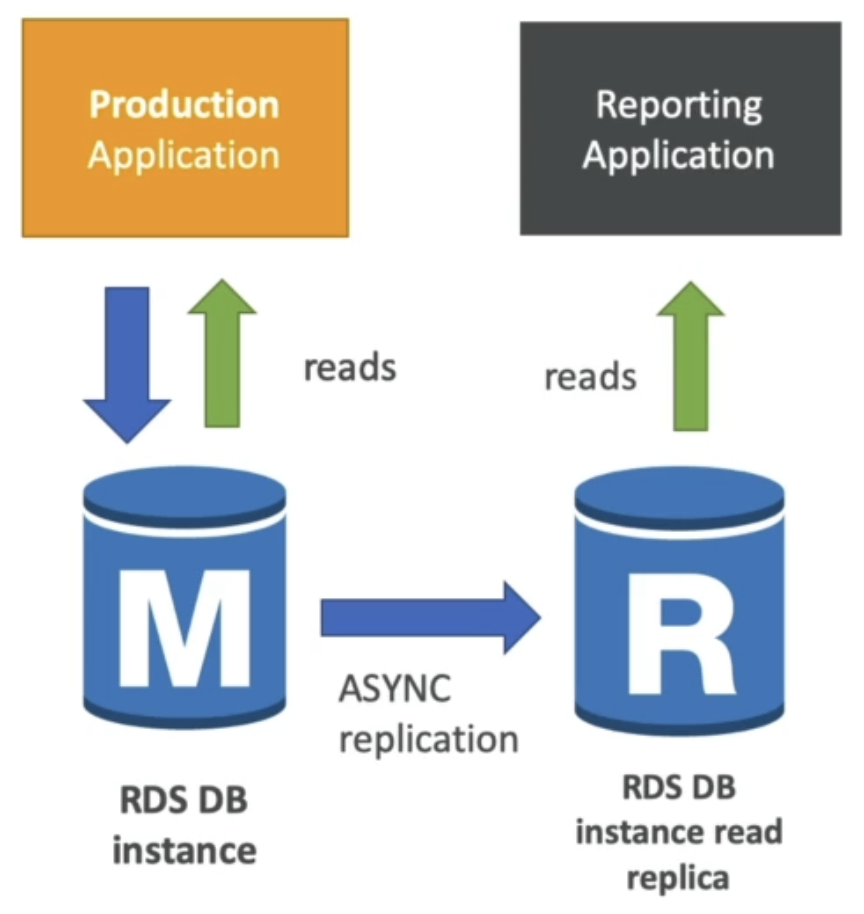

AWS Solutions Architect (Associate) Certification Notes
=======================================================

# What is AWS?
* AWS, Amazon Web Services, is a Cloud Provider.
* It provides servers and services for on-demand computing.
* In contrast to traditional on-premesis IT, where computation power must be known ahead of time and is more or less fixed, cloud providers support scaling up/down on-demand.
* Common high-level use-cases include:
  * Data storage and backups
  * Web hosting
  * Application backends
  * Gaming servers
  * Big data analytics

# Location
## Regions
* AWS is split up into several physical locations across the world.
* For the most part, a customer will pick one specific region and their entire AWS system will live within this region.
  * The exception to this is the small set of global services.
* Regions differ in the services thet offer and how much they charge for each service.
* Analogy: McDonalds (AWS) is a brand, but to operate in different countries, the operation is often structured as a new subsidury company (AWS Region) that is specific to the country that it operates in (for example, in the UK, "McDonald’s Restaurants Limited"). Customers only ever deal with this local company. The global brand will have influence on what each subsidury offers, but the offerings across countries will often not be identical.
* When choosing a region, several factors must be considered:
  * Regulatory compliance - Some countries may have restrictions on where data can be transferred to or held (GDPR).
  * Proximity - AWS servers physically near to customers will generally have a lower latency and thus provide a better experience.
  * Pricing
  * Available services

## Availability Zones (AZs)
* Each region comprises 2 or more AZs (typically 3).
* An AZ is some cluster of physical data centres that are physically independent from others.
* If one AZ goes down because of some issue (e.g. fire), in theory the other AZs will remain available.
* AZs are connected via a high-bandwidth, low-latency network connection.
* AZs are typically used for data replication. Copies of data will be sent across the high speed network connection to be in-sync with the original, and if the original AZ goes down the data is still available in another AZ.
* The likelihood of all AZs in a region (and thus the entire region) going down is very low.

## Points of Presence (Edge Locations)
* TO-DO

# IAM (Identity and Access Management)
* Global service - Settings span all regions
* An AWS account is viewed/modified by users. IAM specifies these users and what permissions they hold.
* An AWS account has a root user created when the account is set up. This user has unrestricted access to everything in the account and should generally only be used for creation of other, less privilidged, users.
* Users can be grouped into some logical collection which share the same permissions.
  * A user can belong to multiple groups.
  * e.g. a "Developer" group, or a "Managers" group.
  * Groups cannot contain other groups, they only contain users.
  * A user does not *have* to belong to a group, they can just be "floating". However this is not best-practice.
* A running application is not a physical person, however it may need to interact with AWS just like a user would. Instead of creating an IAM User for it (and thus breaking the concept that IAM Users are representations of physical people), we create IAM Roles and have the application assume it.
  * An IAM Role has a collection of permissions attached to it just like a user or group would.
  * Assuming a role is a temporary action.
  * Unlike a user, a role does not have a set of credentials to "log in" to.
  * Examples of entites that may assume a role:
    * AWS services like EC2 or Lambda instances
    * Users in another AWS account that you wish to grant permission to access items in your account.

## IAM Policies
* A user (or a group) can be granted permissions by providing it with an IAM Policy.
* An IAM Policy is a JSON document with the following structure:
  * ```json
    {
        "Version": "2012-10-17",
        "Id": "Allow-Stuff-And-Things",
        "Statement": [
            {
                "Sid": "1",
                "Effect": "Allow",
                "Action": [
                    "ec2:AttachVolume",
                    "ec2:CreateTags",
                    "iam:List*"
                ],
                "Resource": ["*"]
            }
        ]
    }
    ```
  * The above defines that some user/group shall be permitted to attach volumes in EC2, create tags in EC2, and perform any list action in IAM.
* There exists an AWS security principle known as the *Least Privilidge Principle* which recommends that a user should be granted the lowest privilidges possible to accomplish their job. This limits risk from accidents or malicious activity.
* There are 3 types of policy:
  * **AWS Managed Policies**: AWS provides a number of pre-defined generic policies that they update themselves for common use-cases (such as read access to a specific service). These policies can then be attached to an IAM user.
  * **User-Managed Policies**: As above, but instead the customer creates their own re-usable policies to attach to one or more IAM users.
  * **Inline Policies**: A policy is embedded in a specific IAM user. This policy is not re-usable and applies only to the user that it is defined within. It is a one-to-one relationship between user and policy.
* Keys/Terms:
  * Version - Policy language version
  * Id - Optional name to reference the policy
  * Statement - A single rule within the policy
  * Effect - `Allow` or `Deny`
  * Action - The privilidge to be allowed or denied
  * Principal - An account/user/role to apply the policy to
  * Resource - The soecific resource this policy applies to (e.g. a specific S3 bucket)
  * Condition - Additional custom condition to evaluate to decide whether the policy should be applied.

## Policy Evaluation
* A user may have many policies applied to them (either directly or via their group(s)). This means that they have the potential to conflict. For example, if a policy attached to the user grants permission to read from S3 but a policy from their group explicitly denies reading from S3.
* IAM flows through a set of steps to determine whether or not any given user has permissions given the set of policies attached to them:
  * 

## User Account Security
* As with many online accounts, an AWS user/root accounts are targets for bad-actors and therefore steps can be taken to mitigate compromisation:
  * Password Policies
    * We can specify that all accounts within an AWS account should meet certain critera such as:
      * Minimum length
      * Containing specific character-types
      * Password expiry times
      * Not re-using past passwords
  * Multi-Factor Authentication (MFA)
    * Using another device in addition to a password to gain access to an account, for example:
      * MFA App (e.g. Authy) - Software that displays an MFA code
      * MFA Fob (e.g. banking fobs) - Hardware device that displays an MFA code
      * Universal 2nd Factor Security Key (e.g. Yubikey) - Plugs into computer
* Interfacing with AWS via command line or from code requires **Access Keys**. This means they can perform actions like a user but without providing it with the user's login credentials. The root user should not be used to generate access keys.

## Reviewing Permissions
* AWS advocates a principle of least privilidge where any given user should have access to only the permissions that they need to accomplish their job and no more. This limits the blast radius should something go wrong.
* In order to help with this, there are 2 tools:
  * IAM Credentials Report
    * Lists all users in an AWS account and their associated credentials status
  * IAM Access Advisor
    * For any given user, lists all of the permissions that have granted and also when they last used that permission.
    * In theory, if a user hasn't used a permission in a long time then they do not need it for their job and it may be reasonable to remove the permission.

# EC2 (Elastic Compute Cloud)
* Rent a virtual server on AWS
* Encompasses the ability to:
  * Rent a server instance (**EC2**)
  * Rent a virtual storage volume (**EBS** - Elastic Block Store)
  * Distribute load (**ELB** - Elastic Load Balancer)
  * Manage scaling (**ASG** - Auto-Scaling Groups)
  * Manage firewall (**Security Groups**)

## Instances
* An EC2 instance is a single virtual machine.
* Instances following the naming convention of `[instance_type][generation].[size]`, for example, `t2.micro`.
  * Instances within the same type will typically be running on similar physical hardware and the size will dictate exactly how much CPU and RAM is available.
  * Different specifications cost different amounts.
  * Computing power is measured in *vCPUs*. Where a vCPU is equal to the number of cores multipled by ht enumber of threads per core (basically, the number fo threads in total). In some instances, the number of cores and threads per core can be configured, in others it is immutable.
* Instance types fit broadly into several categories:
  * General-Purpose
    * A balanced mix of CPU, RAM, and networking speed.
  * Compute-Optimised
    * For computationally-intensive tasks such as batch-jobs or machine-learning.
    * Run on high-performance processors.
  * Memory-Optimised
    * For instances running memory-intensive tasks such as large in-memory databases or caches.
    * Use lots of high-bandwidth RAM.
  * Storage-Optimised
    * For instances requiring high I/O throughput such as data warehousing.
* The base image loaded onto an instance is known as an Amazon Machine Image (AMI). These are similar to Docker base images.
  * AMIs are either made by AWS themselves, by the community, or by the user.
  * AMIs include a variety of Linux distributions, Windows Server images, corporate software setups, etc
* When an instance runs, it can be provided permissions to interact with other AWS services by having it assume a role.
* To have the instance perform a set of pre-defined steps upon launch, a bootstrap script can be provided ("User data").
  * This may be used to, for example, install packages via the image's package manager, and then boot up a web server.
* If an AMI has SSH bundled and enabled by default, it is possible to connect to it via SSH using the private key provided at creation. It is also possible to connect to some AMIs (such as "Amazon Linux 2") using "EC2 Instance Connect" which is a web-browser-based SSH client for some AWS AMI instances.
  * Despite being within the AWS management console, to use EC2 Instance Connect, the instance must have the SSH port (22) allowed as an inbound rule on its security group.

## Security Groups
* A security group is similar to a firewall; it defines the network rules that allow traffic to flow into or out of EC2 instances.
* A security group can contain many instances
* An instance can belong to many security groups
* By default (without additional rules):
  * All inbound traffic is blocked
  * All outbound traffic is allowed
* Security groups can reference other security groups in its rules
  * We can therefore block/allow instances in one security group to talk to those in another without having to reference IP addresses.
* If a connection is disallowed by a security group rule, it will time out. It will not be actively denied.
* Technically, a security group is attached to an ENI (see below), not to an instance directly.

## Instance Purchasing Options
* Choosing an instance type and spinning it up is the most convinient and simple, but also the most expensive way to purchase instances.
* By purchasing them in a different manner, cost can vary:
  * Reserved Instances
    * These are instances that we purchase for a specified amount of time (1 or 3 years).
    * Because this commitement has been made, AWS offers a discount.
  * Convertable Reserved Instances
    * Reserved instances where the instance type can be changed at-will.
  * Scheduled Reserved Instances
    * Reserved instances which are available on a regular schedule (e.g. Every day from 5pm to 7pm).
  * Spot Instances
    * Pricing for instance types operates like a stock market where the market rate fluctuates.
    * The buyer specifies a maximum price they are willing to pay for their instance, if the price ever exceeds this, it will be terminated.
    * Useful for workloads that are not greatly impacted by temporary failure of processing nodes. For example, distributed workloads.
    * It is possible to assign a "Spot Block" to prevent the instance being terminated regardless of price for between 1 and 6 hours if you, for instance, have something critical running.
    * The request for a spot instance can be persistent (keep the request open until some submitted expiry) or one-time (if the instance is ever terminated because it exceeded the max price threshold, don't ever bring it up again).
    * If multiple spot-instances are required for a task, a **Spot Fleet** can be set-up.
      * A Spot Fleet is a specification for the set of spot instances (and optionally also on-demand instances) that are desired as well as the budget.
      * TO-DO: Understand this more
  * Dedicated Host
    * Renting a *specific* physical server for instances for 3 years at a time.
    * Expensive.
    * Useful for regulatory compliance reasons.
    * Useful to comply with licensing restrictions for certain BYOL (Bring Your Own Licence) software.
    * Can control what is running on the server.
    * Pay per server.
  * Dedicated Instances
    * Renting *some* physical server for your instances. However, not a specific one.
    * AWS may decide to move your instance over to a different (bigger/smaller) server (which will still only have your instances on it). They promise that only your instances will be on the hardware, but not that it will stay on the *same* hardware.
    * Pay per instance.

## Networking
* An EC2 instance is automatically allocated a public IPv4 and IPv6 address.
  * Each time an instance is started/stopped, there is a risk the IP address will change.
  * An IP address is owned for the entirety of the time an instance is running.
* Instead of using the default public IP an EC2 instance runs with, it is possible to assign it one of the IPs that you own as an account via the Elastic IP service.
  * By default, with Elastic IP, you have a pool of up to 5 public IP addresses that you can freely attach to any instance you wish.
  * These IP addresses stay the same regardless of whether they are in use or not. Containers starting and stopping do not affect the fact that you own these 5 IP addresses, they will remain.
  * The number of IPs can be raised from the default of 5 by requesting more from AWS support.
  * Using Elastic IP is often bad practice however as there are generally better architectural solutions.
    * For instance, using DNS (Route53) rather than distributing public IP addresses means the same string can map to different instances dynamically.
    * Or, using load balancers (ALBs) can be used to eliminate the need for public IPs on instances entirely.
  * Elastic IPs cost money if they are being wasted (i.e. not attached to an instance).
* The AWS component which grants an EC2 instance networking capability is an **Elastic Network Interface** (ENI).
  * An ENI attaches to EC2 instances to provide:
    * 1 public IPv4 address.
    * 1 or more private IPv4 addresses.
    * A MAC address.
    * Security groups.
  * An ENI is a virtual network card.
  * ENIs are not bound to an instance, they reside independently.
    * However, they are AZ-specific, they cannot move across AZs.
  * Security groups are actually attached to ENIs, not to instances directly.

## Instance Placement Groups
* The physical placement of EC2 instances can be configured to live within an instance placement group whcih defines where instances sit in relation to one another. The choice in group type forms a spectrum of latency and availability:
  * Clustered
    * All instances are on the same physical rack.
    * Lowest latency.
    * Lowest availability. If the rack fails, the entire application goes down. Application will be constrained to 1 AZ.
  * Partitioned
    * Spread the instances across multiple partitions (racks).
    * Can have hundreds of instances per rack.
    * Those instances in the same partition as another will have very low latency but risk going down together upon rack failure.
    * Instances placed in other partitions are protected if anther partition fails.
    * May be across AZs.
  * Spread
    * Every instance is placed on a physically different rack.
    * High latency as networking must always be done between different pieces of physical hardware.
    * Highest availability. If one rack fails, it affects at most 1 instance.
    * Limited to 7 instances per group per AZ.

## Hibernation
* Instead of stopping an instance (thus shutting down the OS and requiring it to load back up when restarting the instance), certain instance types and AMIs support hibernation.
* EC2 Hibernation saves the state of RAM at the point of hibernation to the root storage (The volume that the OS for an instance is running from).
* When restarting from hibernation, the RAM is restored from the volume that it was saved to.
* As far as the running instances knows, nothing happened.
* An instance is permitted to stay hibernated for up to 60 days.
* There are several requirements for EC2 Hibernate:
  * Is a supported instance type
  * Is a supported AMI
  * Instance is using EBS for storage
  * The storage volume is encrypted
  * The storage volume is large enough to fit the RAM dump into
  * The instance is On-Demand or Reserved (Not Spot)

## Storage

### Elastic Block Store (EBS)
* Supports the creation of network drives that can be attached to an EC2 instance.
* Existence of EBS volume persists regardless of the state of EC2 instances.
  * Therefore, the EBS volume can exist even if its associated EC2 instance is terminated or even if it never has an associated EC2 instance at all.
* Bounded to a single AZ.
  * However it can be migrated across as a snapshot (backup).
* An EC2 instance can have many EBS volumes attached to it at the same time.
* Depending on the EBS type, it can either be restricted to being attached to at most one instance at a time or, if it is Nitro-enabled, can attach to multiple at a time with multi-attach.
* Billing is based on capacity where capacity is a mixture of:
  * Volume storage size
  * Input/Output Operations per Second (IOPS)
  * Throughput
* EBS volumes can be useful for failovers as they can be detached from one instance and attached to another quickly.
* An EBS volume can be set to be deleted upon termination of the instance that it attached to.
  * By default, the root volume is set to delete upon termination.
  * By default, no other volumes are set to delete upon termination.
  * This setting is easily toggled for any specific volume.
* The characteristics of the volume are determines by the EBS instance type
  * `gp2` / `gp3`: General purpose SSDs.
    * Between 1GB and 16TB volume size.
    * Maximum IOPS performance only guaranteed for short bursts.
    * `gp2`'s IOPS is linked to the volume size.
    * `gp3`'s IOPS can be fine-tuned independently of the volume size.
  * `io1` / `io2`: High performance SSDs.
    * Between 4GB and 16TB volume size.
    * Maximum IOPS performance can be sustained for the lifetime of the volume.
    * Useful for databases.
    * Requires a Nitro-enabled EC2 instance to exceed 32,000 IOPS.
    * IOPS can be fine-tuned independently of the volume size.
    * Is the only type that supports multi-attach.
      * Assuming it is formatted as a cluster-aware filesystem.
  * `st1`: High-throughput HDD.
    * Intended for data-warehousing or logging.
  * `sc1`: Low-throughput (cold) HHD.
    * Lowest cold.
    * Intended as an archive drive.
* Only SSD instance types can be used as the root volume of an EC2 instance.
* EBS volumes can be encrypted. When encrypted:
  * Data is encrypted at rest.
  * Data is encrypted in-flight.
  * Associated snapshots are encrypted.
  * Minimal latency is introduced.
  * All encrypting/decrypting is handled by AWS, there is no noticable difference from the OS's perspective.
  * AES-256 is used and utilised keys from KMS (Key Management Service).
* Although it is not natively managed by AWS, it is possible to set up a RAID configuration using EBS volumes if the OS of the instance supports it.
  * In partiticular, AWS suggests using RAID 0 or RAID 1 only.
    * RAID 0: Increased throughput. Spread files across two volumes to leverage the IOPS of both drives and increase the total volume size available.
    * RAID 1: Increased fault-tolerance. Mirror files across both drives. No increase in performance, but no loss of data if one volume fails.
* When an EC2 instance is created, this implicitly creates a "root" EBS volume which houses the OS/system files to boot with.
  * When the EC2 instance is terminated, the toot EBS volume is also terminated.

### Local EC2 Instance Store
* Another way to attach storage to an EC2 instance is with a Local EC2 Instance Store.
* These are drives physically connected to the instance rather than being a virtual network drive.
* The primary advantage of this sotrage type is that it is much faster (Higher IOPS).
  * The specific specs are dependant on which specific instance size is selected.
* The main disadvantage is that data on these drives is not persistent after the EC2 instance is stopped.
  * It is therefore best suited for hosting caches/buffers rather than being a long-term storage solution.

### Elastic File System (EFS)
* A hosted file system spanning all AZs that can be shared by EC2 instances.
* Very expensive - but pay per-use.
* Secured by security groups.
* Used by services which require a common data store such as web serving.
* Only supported by POSIX (Linux) based AMIs.
* Has very high performance: thousands of concurrent clients, over 10GB/s throughput.
* Huge potential size (Petabyte-magnitude).
* Performance modes:
  * General purpose: Low latency, lower throughput.
  * Max I/O: Higher latency, higher throughput.
* Throughput modes:
  * Burst: Throughput propostional to storage size. Higher throughput available as bursts.
  * Provisioned: Set throughput independently from storage size.
* **Storage tiers** is the concept that files can be moved to different tiers that define whether or not they will be accessed frequently.
  * If set to be infrequently accessed, the storage cost is decreased, but the retrieval cost is increased.
  * A policy can be set to move files to different tiers automatically after a specified period of time.

# Scaling and Availability
* Scalability can be:
  * Vertical - Increasing size of instance (giving it more power)
  * Horizontal - Increasing the number of instances
* Availability is the measure of how resilient a system is to failure
  * A primary way to manage this in AWS is to ensure that the system's core components are in at least 2 AZs (data centres) at any one time.

## Elastic Load Balancer (ELB)
* A load balancer provides many benefits to a system, it:
  * Spreads load across pool of instances
  * Provides a single entry point to users - no need to know about how many instances are running or even their existence
  * Monitors health of instances and diverts traffic away from them if unhealthy
  * Separates public and private traffic
* EBS encompasses the range of managed load balancers that AWS offers
* Managed service - upgrades/maintenance fully handled by AWS.
* Pricier than implementing own load balancing, but less time consuming.
* Can be configured to perform a health check on any instances it is configured to route to
  * It will periodically poll a port and route on the instance, if HTTP 200 is not returned, the instance will be marked as unhealthy
* As with EC2 instances, a load balancer can have a security group attached to it
  * A common scenario would be to have a load banacer on the load balancer to allow all inbound HTTP traffic, and then a security group on the EC2 instances to only allow HTTP traffic from the load balancer (Or, more specifically, the load balancer's security group).
* The capacity of a load balancer can be scaled, but it takes time.
* ELB access logs log all requests and CloudWatch can provide aggregated statistics.
* "Stickiness" can be configured for certain ELBs.
  * A cookie is generated so that subsequent requests from a user are handled by the same instance.
  * Cookie can be either be:
    * Duration-based
      * The cookie has a TTL after which it will no longer apply.
      * Generated by the load balancer
    * Application-based
      * Interpretation and management of the cookie is left to the instance.
      * The instance will choose whether or not to re-issue the cookie back in the request or to stop sending it back (thus ending the stickiness session).
      * Can be generated by the load balancer or the application.
* Cross-Zone load balancing can be enabled if there are ELBs in different AZs for the same application.
  * If this is disabled, a specific load balancer will only route to instances in its own AZ.
  * If this is enabled, it will distribute it's load across all instances across any enabled AZ.
* Supports SSL/TLS
  * Traffic to the ELB will be encrypted.
  * Once traffic reaches the ELB, SSL termination will occur and the request will then be sent in the network unencrypted.
  * **Server Name Indication (SNI)** is necessary so that one ELB can serve multiple different destination domains.
    * This is a protocol where the client sends the desired destination hostname alongside the SSL handshake.
    * The ELB can then look up the correct SSL/TLS certificate from it's pool of certificates that matches the hostname.
  * Certificated are sourced from **AWS Certificate Manager (ACM)** or they can be uploaded directly.
  * Connection Draining (also known as Deregistration Delay) is the maximum amount of time to wait for existing requests to complete when terminating an instance.
    * We may be terminating the instance because of scaling or because it has become unhealthy.
    * While the instance is in the draining state, it will only work on existing connections, no new connections are routed to it by the ELB.
* **Auto-Scaling Groups (ASG)** are used to scale an application out (more instances) or in (fewer instances) in response to need.
  * An ELB is aware of the number of instances in an ASG.
  * An ASG maintains 3 primary metrics:
    * Minimum size - fewest number of instances that we want running at any one time
    * Maximum size - highest number of instances that we want running at any one time
    * Actual size ("Desired capacity") - the number of instances running at this moment [VERIFY]
  * An ASG has a blueprint for instances that it should create known as the "Launch Configuration" (Or the newer "Launch Templates"). It is very similar to the information provided as part of the setup for an EC2 instance in any other way.
    * Launch configurations
      * Older and no longer recommended
      * Are re-created each time a new ASG is made
    * Launch template
      * Performs all the actions of a launch configuration
      * Supports inheritance from existing launch configurations
      * Supports versioning
      * Cab define a mix or on-demand and spot instances in the same template
  * A "Scaling Policy" defines the requirements for scaling in or out. The policy can be 1 of 3 types:
    * Dynamic
      * Target Tracking
        * Try to maintain this metric as the average for the group
        * e.g. The group should have an average of 40% CPU utilisation.
        * e.g. The group should have an average of 40 requests in per pod per second.
      * Simple / Step
        * Create some alert in CloudWatch, when the ASG sees that a particualr alert has fired, act accordingly
        * e.g. CloudWatch is set up to fire an alert if average CPU usage rises above 70%. When ASG sees this alert, increase instances by 2.
        * e.g. CloudWatch is set up to fire an alert if average CPU usage falls below 30%. When ASG sees this alert, decrease instances by 1.
    * Scheduled
      * Instance count should increase/decrease by/to a certain amount at a specific time.
      * e.g. Set number of instances to 10 at 2pm every day.
    * Predictive
      * Utilise AWS's machine-learning capabilities to forecast load into the future and adjust instances based on this.
  * If an ASG has an IAM role, the EC2 instances it creates will also be given this role.
  * ASG itself is free, fees are related to the instances it creates.
  * After scaling has occured, the group enters a cooldown period where no changes to the number of instances will happen for some amount of time (Defualt: 300 seconds). This allows the metrics to stabalise before adjustments are reconsidered.
  * When scaling down, by default, AWS decides on the particular instance to destroy by:
    * Selecting the AZ with the most instances
    * Choosing the instance with the oldest launch configuration/template
  * The typical lifecycle of instances within an ASG is as follows:
    * Pending
    * In Service
    * Terminating
    * Terminated
  * It is possible to attach lifecycle hooks to the "Pending" and "Terminating" states so that custom actions are performed at these stages.
    * For example, duuring the "Terminating" state, we may wish to extract logs before the instance is terminated.
    * While performing a hook, the instance enters the "Pending:Wait" or "Terminating:Wait" state.
    * Once a hook is performed, the instance enters the "Pending:Proceed" or "Terminating:Proceed" state and shortly afterwards reaches the "Terminated" state.

### Classic Load Balancer
* Somewhat-deprecated; use is discouraged.
* Supports HTTP, HTTPS, TCP.
* Does not support IPv6.
* Supports stickiness.
* Cross-Zone load balancing is enabled by default via web console and disabled by default via CLI/API.
  * No additional charges for routing across AZs.
* Does not support Server Name Indication (SNI).

### Application Load Balancer (ALB)
* OSI layer 7 (application): HTTP, HTTPS, WebSocket
* Supports redirection (For instance, from HTTP to HTTPS)
* Supports routing tables to build rules to route to specific target groups based on various criteria
  * Path
  * Hostname/Subdomain
  * Query values
  * HTTP headers
* Target groups can be pools of:
  * EC2 instances
  * Lambda functions
  * ECS tasks
  * Private IP addresses
* The instance handling the request no longer directly sees the IP address of it's client, it sees the load balancer as its client instead. However, ALB adds a `X-Forwarded-For` header to the request containing the original client's IP address as well as `X-Forwarded-Port` and `X-Forwarded-Proto`.
* ~400ms latency
* Accessible via a domain name.
* Supports stickiness.
* Cross-Zone load balancing is always on.
  * No additional charges for routing across AZs.
* Supports Server Name Indication (SNI).

### Network Load Balancer (NLB)
* OSI layer 4 (transport): TCP, TLS, UDP
* Much more performant than an ALB as it is working at a lower level
  * ~100ms latency
  * Millions of requests per second
* Accessible via a static IP (per AZ).
  * Can use an Elastic IP if the randomly-assigned one is not desirable.
* Traffic appears to have come directly from the original client, the request is not manipulated at all (No change of source destination).
* Cross-Zone load balancing is off by default but can be enabled.
  * Charges apply for routing across AZs.
* Supports Server Name Indication (SNI).

### Gateway Load Balancer
* TODO
* Beyond scope of exam?

# Relational Database Service (RDS)
* Managed database service for databases using SQL as a query language
  * PostgreSQL
  * MySQL
  * MariaDB
  * Microsoft SQL Server
  * Amazon Aurora
  * Oracle
* It is possible to host a database service in an EC2 instance, however this would not provide the added benefits of RDS being a managed service
  * Continuous backups
  * Cross AZ support
  * Scalability
  * Read replicas
  * Monitoring dashboards
  * Automatic upgrades

## Backups
* AWS runs an automated backup of RDS instances by default
  * A full backup is ran once per day during the maintenance period
  * In addition to a full backup, transaction logs are also backed up every 5 minutes
  * Automatic backups are retained for at most 35 days (default: 7 days)
  * This means that it is possible to restore to any point in time up to the oldest backup
* Snapshots are backups that are run manually
  * Can be kept forever

## Auto-Scaling
* When setting up an RDS instance, the storage capacity (backed by EBS) is set.
* If the available storage is running low, RDS can be set to detect this and scale the storage capacity up automatically.
  * A upper limit can be set so that it doesn't grow forever.
  * Auto-scaling will trigger if
    * AWS detects that less than 10% of the storage is remaining.
    * The database has been low of storage for at least 5 minutes.
    * No scaling has occurred in the last 6 hours.

## Read-Replicas
* A near-clone of a database which can be used on a read-only basis.
* Can take load from the main database by reducing the total number of read requests it recieves.
* Eventually-consistent
  * The read-replica is updated by async calls from the main database, this means that it may serve slightly different data if both instances are called at the same time.
* Can have up to 5 read-replicas per main database.
* Only the original/main database can be used for writing/updating.
* Example use case: A reporting/analytics application wants to utilise data in a production database.
  * By creating a read-replica, they can query similar data to the live database without incurring additional load as it will only access the read-replica.
  * 
* Data transfer to a read-replica is free within the sae region (even if the replicas are in different AZs)

## Multi-AZ Disaster Recovery
* Replicates the main database **synchronously** to another instance in another AZ.
* The application talks to the database via a DNS name.
  * If the main database fails, the DNS will automatically failover to the backup database without the application being aware.
* Being synchronous instead of asynchronous is the main arhcitectural difference between Multi-AZ DR and a read-replica and hence why it is used for different purposes.
* Replication to the backup database is part of the original transaction
  * If writing to the backup database fails, the entire transaction fails.
  * The backup database is therefore a perfect clone of the main database.
* The standby database is not accessible directly. Only the main database can be written to or read from.
* Read replicas can now be set up as Multi-AZ [TODO: check details].
* Enabling Multi-AZ can be modified at runtime with no downtime.

## Security

### Encryption
* Data can be encrypted in-flight and at rest in RDS databases.
* AES-256 encryption is supported by KMS for at-rest.
* SSL/TLS encryption is supported by CMS for in-flight.
  * This can be enforced from a database engine level in PostgreSQL and MySQL by setting the appropriate settings in each of the engines. If set correctly, the engine will reject any non-SSL connections.
* A database being encrypted at-rest or not is decided when the database is created.
  * If we wish to encrypt or decrypt a database, it is possible to do this by:
    * Creating a snapshot of it (Snapshots have the same encryption of the database)
    * Toggle encryption of the snapshot
    * Restore a database using the snapshot (the database will have the same encryption as the snapshot)
    * Delete the old database
    * Point services to the new instance

### Networking
* A database should only be deployed to a private subnet.
  * i.e. it can only be accessed on the local network by services/applications on the same subnet, it should not be accessible from the public internet.
* Security groups can (should) be applied to databases to limit the access to the database to only permitted sources.

### Access
* Permissions on RDS management activities are controlled by IAM policies.
  * For example, one person can be permitted to only view the list of database instances whereas another person can be permitted to create new ones.
  * This only applies to the RDS "wrapper" around the database engines, they do not dictate permissions once inside the engine (i.e. IAM has no real knowledge of PostgreSQL, MySQL, or any other engine that is actually running in the service).
* Controlling access within the database engine itself can be managed using traditional username/password pairs as it would be if not in AWS.
  * PostgreSQL and MySQL additionally support IAM-based authentication.
    * If the IAM role/user has the correct permissions, they can send a request to RDS for an authentication token.
    * This token can then be sent alongside requests to the database instance as verification to perform database actions.
    * This token only lasts for 15 minutes and a new token will need to be fetched if access is needed after this time.

## Amazon Aurora
* Amazon's propriatary database engine.
* Functionally compatible with MySQL and PostgreSQL
  * This means that either a MySQL or PostgreSQL driver can be used in an application and it will work with an Aurora database; the application won't even know it is Aurora.
* Several times faster than equivalent RDS databases as it is cloud-optimised.
* Costs about 20% more than other RDS engines.
* Unlike with other RDS instances where the EBS volume that backs the database must be selected and switched out over time, an Aurora database automatically grows in 10GB increments (up to 128TB) automatically and is fully managed by AWS.
* Read replicas are faster to synchronise for an Aurora database and it is also possible to have up to 15 of them instead of 5.
* Failover is instantaneous.
* Aurora has higher availability than other RDS offerings
  * 6 copies of the data are created across 3 AZs automatically.
  * 2 copies can fail before write operations are impacted.
  * 3 copies can fail before read operations are impacted.
  * Data can self-heal via peer-to-peer replication.
  * Each copy of data is sharded across hundreds of physical volumes.
* Access to an Aurora database is accomplished via 1 writer endpoint and 1 reader endpoint (by default).
  * The endpoints stay the same regardless of what is happening to the physical instances in the background.
    * If the master (write) instance fails, it failsover automatically and the write endpoint switches without the user being aware.
    * Read replicas can have scaling policies applied and therefore the number of replicas can change frequently. The read endpoint stays the same and acts as a load balancer pointing to all replicas regardless of how many there are. The user is unaware of the physical instances.
      * Just like with EC2 ASGs, the scaling can be based on things like average CPU utilisation across all read replicas.
* It is possible to swap out the default endpoints for custom ones that point to a specific subset of the replicas.
  * This might be desired if some of the replicas are running on more powerful machines and therefore a custom endpoint could be used to run queries on only these more powerful endpoints.
  * When using custom endpoints, the default reader endpoint should no longer be used. To reference the remaining replicas, another custom endpoint to refer to them should be made.
* **Aurora Serverless** is a configuration options that puts the full responsibility of managing the instances on to AWS.
  * AWS will decide how many instances to have and what hardware they will run on.
  * Pay by the second.
  * AWS will predict what is necessary based on past and current usage.
* **Multi-Master** is a setting for high-availability. It sets all instances to be both read and write enabled.
  * The client has an open connection for all instances.
  * The instances synchronise with each other.
  * In the event of an instance failure, failover is instant as the client can simply write to one of the other connected instances. There is no need to wait for a read-only instance to be promoted to master.
* **Global Aurora** is a configuration where the same database is replicated across multiple regions.
  * It is similar to replication across AZs, just at a higher level for extreme availability.
  * Each region can then have up to 16 read-replicas so that local latency is improved.
  * 1 region is the primary region and is the only one with read and write capabilities.
  * Up to 5 other regions are used as read-only regions.
  * If the primary region goes down, another region is promoted.
    * This takes less than 1 minute.
* Aurora has integration with AWS's machine learning services (e.g. SageMaker and Comprehend).
  * Users can perform specialised SQL queries on the database and RDS will in-turn query AWS machine-learning services for the result.

# ElastiCache
* Managed in-memory caching databases
  * Redis
  * Elasticached
* High performance, low latency
* As with other managed services, AWS handles OS patching, maintenance, backups, etc.
* Typical use case is to cache common database queries to a database so that load is taken off of the database instance.
* As with RDS, the "power" of the cache is determined by the instance type the cache runs on.
* IAM is not supported to authentication actions within the cache instances.
  * IAM does control permissions for AWS-level ElastiCache operations (create/delete clusters etc)

## Redis vs Memcached

| Technology | Instances Used For | Persistent | Supports Backup/Restore  | Use Cases                 |
|------------|--------------------|------------|--------------------------|---------------------------|
| Redis      | Replication        | Yes        | Yes                      | Database, cache           |
| Memcached  | Sharding           | No         | No                       | Performance-focused cache |

# Route53
* Route53 is a managed DNS service.
  * DNS is a set of records detailing how to translate a given domain name into an IP address.
* AWS primarily handles 4 record types:
  * `A`: Hostname to IPv4 address
  * `AAAA`: Hostname to IPv6 address
  * `CNAME`: Hostname to hostname
    * The resulting hostname will then need to be evaluated using further DNS records, eventually resolving as an IP address.
    * Cannot route a root domain - it can only route subdomain requests.
  * `ALIAS`: Hostname to hostname (AWS resource)
    * Used in Route53 to route to AWS resources (e.g. an EC2 instance or an ELB)
    * Works for either root domains or subdomains.
    * Free of charge in AWS.
    * Route53 supports native healthchecks on these records.
* Route53 can route both public domains and domains that are "made-up" and only accessible within a VPC (e.g. *mydomain.mycompany.internal*)
* Just like IAM, Route53 is a global service so is not tied to a specific region.
  * It wouldn't make sense to tie it to a region as this would mean domains were not unique.
* A DNS response can have a TTL included with it so that the client is asked to not request the record again until the TTL has expired and instead use its own local DNS cache.
  * High TTLs (multiple hours) mean less load on the DNS server but greater chance of outdated records.
  * Low TTLs (minutes) mean greater load on the DNS server but less chance of outdated records.
* As with ELBs, we can configure health checks so that Route53 will not route traffic to destinations if it fails the health check.
  * By default, requires 3 consecutive successes/failures when polling an instance to change health state.
  * Can also tie a healthcheck to CloudWatch so that a certain alarm firing would make indicate an unhealthy destination.
  * An alarm can be automatically fired if a healthcheck fires.
* Route53 can also act as a domain name registrar to purchase domain names from ICANN.
* Route53 can act as a DNS provider for domains that were not purchased through Route53. To do this:
  * Create a new **Hosted Zone** in Route53
    * A Hosted Zone is a container for holding DNS information about a single root domain in Route53.
  * Update the nameserver for the domain on the registrar's website to point to Route53's nameservers.
    * It is the same process as when transferring DNS responsibilities to Cloudflare.

## Routing Policies
* Route53 can be used to load balance requests to multiple servers - how it does this is defined in a *routing policy* on the DNS record.
  * Simple
    * The most basic policy acheives "client-side load balancing" and is accomplished by setting a single record with multiple prospective IP addresses.
    * When a DNS request is made, all of these IP addresses are returned to the client.
    * The client chooses one of the IP addresses at random to send its request to.
  * Weighted
    * Sends a percentage of traffic to specific IP addresses.
    * Useful for A/B testing of new features/versions.
    * Multiple records for the same input are created, just with different destinations and weights.
  * Latency
    * Sends traffic to the desination with the lowest latency.
    * Latency is measured as the time taken for the user to reach an AWS region.
      * This is usually the one that they are geographically closest to, but not necessarily.
    * Multiple records with the same input are created, the AWS region that the destination is closest to is selected.
  * Failover
    * Always routes to the same destination unless the destination fails it healthcheck, in which case all traffic is routed to the secondary.
    * Requires two records to be created, each with the same input hostname, but one marked as *primary* and one marked as *secondary*.
  * Geolocation
    * Route to an instance based on the user's physical location (either continent or country).
      * This does not necessarily mean routing to the closest server, it is an unconstrained mapping from user location to destination.
        * There is nothing preventing the creation of a policy which sends all users in Japan to a UK destination even if there is already an equivalent Japanese destination.
    * Records are created for each location a user may be, and the desired destination is set on a case-by-case basis.
    * A default record is created in case there is no record specified for a given user's location.
  * Geoproximity
    * Route users based on their physical proxity to a resource.
    * If it is an AWS resource, AWS already knows the physical location of it. If it is a non-AWS resource, the latitude/longitude of the desination is provided to the policy.
    * In its most simple form, the user will be routed to the resource that they are physically closest to.
    * Implementing a **bias** value to any one record means that its influence/attraction is altered.
      * If a higher value, a user is "more strongly pulled" towards that instance - this may be enough to have the user's requests go to this destination rather than one that the user is actually physically closer to.
    * It is often used when needing to easily shift additional traffic to a specific destination - yet still maintaining geographical awareness.
  * Multi-Value
    * Essentially the same as simple routing but each possible destination has an associated health check. Only destinations that have a healthy destination will be included in the payload returned to the user.
    * Up to 8 healty destinations will be included in the response.
    * The user, upon receiving the payload of healthy destinations, will choose one at random in the same way as it would for simple routing.

# Elastic Beanstalk
* A managed service which offers an ecosystem to deploy applications into where much of the infrastructure is managed for you.
  * All the developer needs ot focus on is the development of code, not infrastructure.
* Somewhat similar to Kubernetes.
* Habndles the deployment of related AWS services such as ELB, ASGs, EC2, etc.
* Although much of the configuration is auto-created, can still be manually adjusted according to developer needs.
* Supports the creation of different environments (e.g. dev, stg, prod).
* Beanstalk is free, but the infrastructure created by Beanstalk may cost.
* Beanstalk supports many application technologies (e.g. Java, Python, Docker) natively.
  * Alternative technologies can be run by creating a custom configuration.

# S3
* Supports the storage of objects (files) into buckets (directories).
* Buckets belong to a region.
* Buckets must have a globally unique name.
  * Even across regions and across users.
  * e.g. If some user somewhere has a bucket called *test*, nobody else anywhere can also create a bucket called *test*.
* Technically, S3 has no concept of intermediate directories from the bucket root, however it is very common to name objects using a relative path string (e.g. my_folder/my_file.txt) to act as if there were directories.
  * The AWS console will usually parse these file names and present the files in a folder structure if this is done, however this is simply a presentation convinience.
  * The name of an object is known as the **key**. If the key is formatted like a path, the key is then comprised of two parts: the prefix (the sub-directories) and the object name (the basic file name e.g. *my_file.txt*)
* The object value (content) can be a maximum of 5TB in size.
  * If greater than 5GB, the object must be split into parts and uploaded independentaly of other parts.

## Versioning
* Is enabled on a per-bucket basis
* If an object with an identical key is uploaded, it will replace the existing object as the latest version and the version number of the object will be incremented (e.g. from *1* to *2*).
* Can be toggled on or off at any time. This simply starts or suspends versioning.
  * Existing version archives will not be removed if versioning is turned off.
  * Objects uploaded before versioning was enabled will simply have a version number of *null*.
* When deleting a versioned object, the user is not actually deleting it from the bucket, instead they are adding a **delete marker** to it.
  * A delete marker is similar to having a new version of the file with size of 0 bytes that AWS interprets to not show the file in many situations.
* Permanently deleting a versioned object is acheived by deleting the specific version(s) rather than the object as a whole.
  * Therefore, it is possible to restore a deleted versioned file by deleting the delete marker (as the delete marker is simply a special version of the object).

## Encryption
* Objects stored in S3 can be encrypted at rest (i.e. stored in an encrypted format).
* Communication with S3 can be done over to HTTPS to also encrypt data in-transit.
* Objects may be encrypted using 1 of 4 possible methods:
  * SSE-S3
    * "Server-side Encryption: S3"
    * Encryption key is completely owned and managed by AWS, the user never sees or interacts with it.
    * The user states their intention for the object to be encrypted using SSE-S3 by passing `"x-amz-server-side-encryption": "AES256"` as a header in the HTTP(S) request.
  * SSE-KMS
    * "Server-side Encryption: KMS"
    * Encryption key is stored in KMS
      * Therefore has increased level of user control and audit trail capabilities.
    * The user states their intention for the object to be encrypted using SSE-S3 by passing `"x-amz-server-side-encryption": "aws:kms"` as a header in the HTTP(S) request.
  * SSE-C
    * "Server-side Encryption: Client"
    * Encryption key is provided to AWS by the user.
    * The provided key is not persisted in AWS. After AWS has encrypted/decrypted the file, the key is discarded.
    * When uploading/downloading objects, the encryption key must be provided in the HTTPS header so that AWS knows how to encrypt/decrypt the object.
    * As the key is sensitive, when using SSE-C, HTTPS must be used, HTTP is disabled.
  * Client-Side Encryption
    * The user handles the encryption and decryption of the file themselves locally.
    * AWS has no role to play in the at-rest encryption and therefore never sees a key.
      * As far as AWS is concerned, it is simply storing a stream of bytes without any further context.
    * The AWS SDKs provide a number of encryption utilities to handle client-side encryption.
      * There are S3 SDKs for various languages that support client-side encryption.
      * There exists a **AWS Encryption SDK** which support encrypting various data for storage in AWS that is not just S3-specific too.
* A default policy for encryption of all new objects in a bucket can be specified.
  * This can either be *SSE-S3* or *SSE-KMS*.
  * Uploading a specific file and specifying some other encryption method will override the default and us ethat encryption for that object specifically.
* Encryption is applied on a per-object basis. Therefore within a bucket there may exist files that have different (or even no) types of encryption. Even versions of the same object may have different encryption methods applied.
